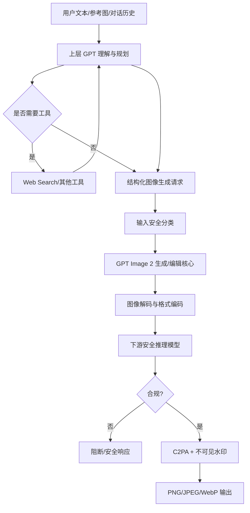

**版本日期：2026-07-10**  
**研究对象：ChatGPT Images 2.0 产品能力、API 模型 `gpt-image-2`，以及其与 OpenAI 原生多模态图像生成技术路线的关系**

---

## 摘要

截至 2026 年 7 月 10 日，OpenAI 已公开 **ChatGPT Images 2.0** 的产品能力、系统级安全架构、API 接口、输入输出约束、计费和限流信息，但**没有公开 GPT Image 2 的底层网络结构、参数量、层数、视觉 tokenizer、训练数据规模、训练损失、推理采样算法或硬件部署方案**。[1][2][6]

因此，对“GPT Image 2 是不是扩散模型”最准确的回答是：

> **官方没有说明 GPT Image 2 是扩散模型，也没有正式说明它是自回归模型。现有公开证据不足以作出确定判断。**

不过，OpenAI 对前代 **GPT-4o 原生图像生成模型**有过明确表述：它“不同于作为扩散模型运行的 DALL·E，是原生嵌入 ChatGPT 的自回归模型”。[7] 2025 年 API 模型 `gpt-image-1` 又被官方称为驱动 ChatGPT 图像生成的“原生多模态模型”。[9] GPT Image 2 延续了 GPT Image 产品线，并继续强调文字渲染、复杂指令遵循、图像编辑、世界知识和多模态推理。因此，**“延续自回归原生多模态路线，或采用自回归与图像解码/精修模块结合的混合架构”是较合理的技术假设**；但这仍然只是基于产品血缘和能力特征的推断，不能视为官方事实。

另一个必须区分的概念是：

- **ChatGPT Images 2.0**：完整产品系统，可能包含 GPT 推理模型、Web Search、提示词重写、图像生成工具、安全分类器、输出审核和内容溯源。
- **`gpt-image-2`**：OpenAI API 暴露的图像生成/编辑模型。
- **Images with Thinking**：由上层推理模型先规划、检索和组织任务，再调用图像生成模型；它不能证明图像生成核心本身采用“思维链”或与上层推理模型完全同构。[3][6]

---

## 1. 调研方法与证据分级

本报告优先采用 OpenAI 官方发布页、API 文档、系统卡和论文，不以社区猜测、反向工程或营销转述作为架构事实。

### 1.1 证据等级

| 等级 | 定义 | 本报告写法 |
|---|---|---|
| A：官方直接披露 | OpenAI 明确写入模型文档、系统卡、论文或 API 参考 | “已确认”“官方公开” |
| B：官方血缘证据 | 前代模型或同系列模型有明确披露，但 GPT Image 2 本身未披露 | “前代已确认”“不能直接外推” |
| C：工程推断 | 根据接口约束、能力表现和常见架构推测 | “可能”“合理假设” |
| D：未知 | 没有足够公开证据 | “未披露”“无法判断” |

### 1.2 结论边界

本报告不会把以下信号误当作模型架构证明：

- API 按“image tokens”计费；
- 图片尺寸要求为 16 的倍数；
- 支持 partial image streaming；
- 支持高保真图像编辑；
- 生成速度或价格随质量变化；
- 产品名称包含 GPT。

这些现象可以由自回归、扩散、流匹配（flow matching）、离散扩散或混合系统实现，单独均不足以判定底层算法。

---

## 2. 模型与产品身份

## 2.1 发布时间和命名

OpenAI 于 **2026 年 4 月 21 日**发布 ChatGPT Images 2.0，重点宣传更强的文字渲染、多语言文本、写实性、视觉推理、复杂构图、密集文本和灵活宽高比。[1]

API 对应模型为：

- 稳定别名：`gpt-image-2`
- 固定快照：`gpt-image-2-2026-04-21`
- 输入：文本和图像
- 输出：图像
- 官方定位：当前最高质量级别的图像生成模型
- 速度标注：Medium
- Fine-tuning：不支持[2]

“ChatGPT Images 2.0”和“GPT Image 2”高度相关，但在技术讨论中不应完全等同：前者是用户面对的产品系统，后者是可通过 API 调用的生成模型。

## 2.2 技术演进时间线

| 时间 | 系统/模型 | 官方已公开的核心路线 |
|---|---|---|
| 2021 | DALL·E 1 | 12B 参数、decoder-only Transformer；将文本和离散图像 token 串联，自回归预测；图像由离散 VAE 压缩为 32×32 token 网格。[10] |
| 2022 | DALL·E 2 | CLIP 图像嵌入条件化的扩散解码器；包含先验模型和图像扩散生成阶段。[11] |
| 2023 | DALL·E 3 | 继续采用扩散生成路线，重点通过高质量、合成的描述性 caption 提升提示词遵循。[12] |
| 2024–2025 | GPT-4o Native Image Generation | OpenAI 明确称其为**自回归模型**，原生嵌入 ChatGPT，而非 DALL·E 式扩散模型。[7] |
| 2025 | `gpt-image-1` | OpenAI 称其为驱动 ChatGPT 图像生成的原生多模态模型。[9] |
| 2025-12 | GPT Image 1.5 | 更精确的编辑保留、更快生成和更强文字处理。[18] |
| 2026-04 | GPT Image 2 / ChatGPT Images 2.0 | 能力和 API 公开；底层架构、参数量和训练算法未公开。[1][2][6] |

---

## 3. 最核心问题：GPT Image 2 是扩散模型吗？

## 3.1 官方答案：未披露

OpenAI 的以下材料均没有把 GPT Image 2 定义为 diffusion、autoregressive、flow matching 或其他生成范式：

- ChatGPT Images 2.0 发布页；[1]
- GPT Image 2 API 模型页；[2]
- Image Generation API 指南；[3]
- ChatGPT Images 2.0 System Card。[6]

因此，不能使用确定语气说“GPT Image 2 是扩散模型”，也不能直接说“GPT Image 2 已确认是自回归模型”。

## 3.2 为什么很多人会把它判断为自回归模型

最强的公开血缘证据来自 GPT-4o 原生图像生成系统卡补充文件：

> OpenAI 明确说明，DALL·E 以扩散模型运行，而 4o 图像生成是原生嵌入 ChatGPT 的自回归模型。[7]

同时：

1. `gpt-image-1` 被称为原生多模态模型，而非 DALL·E 系列模型；[9]
2. GPT Image 2 继续强调复杂文本、多轮编辑、世界知识和指令遵循；[1][2]
3. API 对文本和图像统一接收，并把输入图像作为高保真条件处理；[3]
4. ChatGPT 中的推理模型可以把图像生成作为工具调用，形成“规划—生成—审核”的完整链路。[3][6]

这些证据支持“GPT Image 2 很可能继承原生多模态/自回归路线”，但没有回答以下细节：

- 是否完全逐 token 自回归生成二维图像；
- 是否先自回归生成离散视觉 token，再由卷积或 Transformer decoder 解码；
- 是否存在扩散或流匹配精修器；
- 是否采用 coarse-to-fine、多尺度或块级生成；
- 是否通过自回归规划布局，再由另一生成器完成像素渲染。

## 3.3 三种可行架构假设

### 假设 A：原生自回归视觉 token 模型

模型将文本 token、输入图像 token 和输出图像 token 放入统一或相互连接的 Transformer 表征空间，按条件概率逐步生成输出视觉 token：

\[
p(\mathbf{z}_{img}\mid \mathbf{x}_{text},\mathbf{z}_{ref})
=\prod_{i=1}^{N}p(z_i\mid z_{<i},\mathbf{x}_{text},\mathbf{z}_{ref})
\]

其中：

- \(\mathbf{x}_{text}\)：文本 token；
- \(\mathbf{z}_{ref}\)：参考图像的视觉表征；
- \(\mathbf{z}_{img}\)：待生成图像的离散或连续量化视觉 token。

**支持证据：**

- GPT-4o 前代被官方确认是自回归图像模型；[7]
- 复杂文本渲染和多模态指令遵循通常受益于统一序列建模；
- GPT Image 系列强调原生多模态而不是独立的文本编码器加图像生成器。[9]

**不确定点：**

- OpenAI 未公开视觉 tokenizer、codebook、token 排列顺序、位置编码或 decoder；
- “image token”计费单位可能只是计费抽象，不必然等于网络内部的离散 token。

**本报告判断：中等偏低置信度。**

### 假设 B：自回归语义/布局生成 + 神经图像解码或精修

上层模型先生成高层视觉 token、场景图、布局、文字区域或低分辨率潜变量；再由专用 decoder、扩散模块、流匹配模块或其他神经渲染器还原高分辨率图像。

这种混合方案可以兼顾：

- 自回归模型的语言和文字对齐能力；
- 专用图像生成器的局部纹理和高分辨率效率；
- 多尺度控制和任意宽高比；
- 编辑时对输入图像结构和身份的保留。

**支持证据：**

- 最高输出尺寸可达到接近 4K，纯逐像素自回归通常不经济；
- API 支持低、中、高质量档位，可能对应不同生成步数、token 预算、解码器配置或精修阶段；
- 任意尺寸仍受 16 倍数和像素总量约束，符合潜空间编码/解码器常见工程约束。

**反证限制：**

- 上述现象同样可由纯扩散或纯自回归的多尺度实现；
- 没有官方材料确认混合精修器。

**本报告判断：中等偏低置信度，与假设 A 不互斥。**

### 假设 C：纯扩散或流匹配模型

其训练目标可能是预测噪声、速度场或数据流：

扩散噪声预测形式示例：

\[
\mathcal{L}_{diff}
=\mathbb{E}_{x,\epsilon,t}\left[
\|\epsilon-\epsilon_\theta(x_t,t,c)\|_2^2
\right]
\]

其中 \(c\) 是文本和参考图像条件。

**支持理由：**

- 扩散/流匹配仍是高分辨率图像生成的主流高质量路线；
- 多尺寸、图像编辑、mask 和渐进预览都能自然实现。

**反对理由：**

- OpenAI 已明确把 GPT-4o 原生图像生成与 DALL·E 扩散路线区分开；
- GPT Image 系列命名和产品血缘更接近原生多模态 GPT 图像生成，而不是 DALL·E。

**本报告判断：低置信度，但不能排除。**

## 3.4 为什么接口信号不能证明架构

| 观察到的接口特征 | 容易产生的误判 | 更准确的解释 |
|---|---|---|
| 按 image token 计费 | 内部必然是离散视觉 token 自回归 | 可能只是统一的计费单位，未必等同底层表示 |
| 尺寸必须为 16 的倍数 | 必然有 stride=16 VAE | 很多卷积、Transformer、扩散和混合解码器都需要尺寸对齐 |
| 支持 partial image streaming | 必然逐 token 生成图像 | 扩散中间结果、分块解码和渐进式 JPEG/WebP 也可流式返回 |
| 高质量档更贵、更慢 | 必然增加扩散步数 | 也可能增加 AR token、重采样、reranking、精修或超分步骤 |
| 能准确写字 | 必然是纯 AR | 文字准确性也可以通过 OCR/布局监督、强化学习或辅助损失改善 |

---

## 4. 已公开的 API 与运行参数

本节中的“参数”是**用户可调用的 API 参数**，不是神经网络可训练参数量。

## 4.1 输入与输出

| 项目 | GPT Image 2 |
|---|---|
| 文本输入 | 支持 |
| 图像输入 | 支持 |
| 图像输出 | 支持 |
| 文本输出 | 模型本体不是文本输出模型；在 Responses API 中可由上层 GPT 模型同时生成文本 |
| 最大 prompt 长度 | 32,000 字符 |
| 单次生成数量 `n` | 1–10 |
| 图像编辑 | 支持 |
| Mask 编辑 | 支持 |
| Fine-tuning | 不支持 |
| 输入图像 fidelity | 固定为 high，不允许切换 |
| 透明背景 | GPT Image 2 不支持 |
| 输出格式 | PNG、JPEG、WebP |
| 返回方式 | Base64 编码图像 |
| Partial image streaming | 支持，最多请求 3 张中间预览图 |

以上来自 API 模型页、图像生成指南和接口参考。[2][3][4]

## 4.2 分辨率和宽高比约束

官方主 API 文档公开的约束为：[3][4]

- 宽和高均须是 **16 的倍数**；
- 单边最大值不超过 **3840 px**；
- 宽高比不超过 **3:1**；
- 总像素范围约为 **655,360–8,294,400**；
- 超过 2560×1440 总像素量的输出仍被标为实验性区域；
- 官方推荐常见尺寸包括 1024×1024、1536×1024、1024×1536，以及更高分辨率组合。

OpenAI Cookbook 一处文字写的是边长应“less than 3840”，而主 API 参考使用“最大 3840”的约束，存在轻微文档不一致。[3][17] 生产环境应以当前接口校验结果和 API reference 为准，并在上线前对边界尺寸做实际请求测试。

## 4.3 质量档位与延迟

`quality` 可设为：

- `low`
- `medium`
- `high`
- `auto`

低质量最快，高质量通常消耗更多输出 token、延迟更高。[3][4] OpenAI 提醒复杂提示词可能出现较长生成延迟，极端情况下接近两分钟。[3] 这只是服务级延迟描述，无法反推出采样步数或网络结构。

## 4.4 速率限制

API 文档给出的 `gpt-image-2` 限流按账户 tier 区分：[2]

| Tier | Tokens per minute | Images per minute |
|---|---:|---:|
| Free | 不支持 |
| Tier 1 | 100,000 | 5 |
| Tier 2 | 250,000 | 20 |
| Tier 3 | 800,000 | 50 |
| Tier 4 | 3,000,000 | 150 |
| Tier 5 | 8,000,000 | 250 |

这些是 API 限流，不等同于 ChatGPT Plus 产品内的图片生成额度。

## 4.5 计费

API 定价页显示，GPT Image 2 按文本输入 token、图像输入 token和图像输出 token 分别计费。[5]

### 标准实时 API

| 类型 | 每 100 万 token |
|---|---:|
| 文本输入 | 5 美元 |
| 缓存文本输入 | 1.25 美元 |
| 图像输入 | 8 美元 |
| 缓存图像输入 | 2 美元 |
| 图像输出 | 30 美元 |

### Batch API

| 类型 | 每 100 万 token |
|---|---:|
| 文本输入 | 2.50 美元 |
| 缓存文本输入 | 0.625 美元 |
| 图像输入 | 4 美元 |
| 缓存图像输入 | 1 美元 |
| 图像输出 | 15 美元 |

文档还给出典型单张图像输出成本示例：[3][5]

| 尺寸 | Low | Medium | High |
|---|---:|---:|---:|
| 1024×1024 | 约 $0.006 | 约 $0.053 | 约 $0.211 |
| 1024×1536 / 1536×1024 | 约 $0.005 | 约 $0.041 | 约 $0.165 |

非正方形图像在示例中反而可能比 1024×1024 便宜，这说明“输出 image token”不应被简单理解为固定像素网格 token 数。它可能包含质量档、内部压缩、分块方式或计费归一化因素。

---

## 5. 文本与图像如何对齐

## 5.1 GPT Image 2 的直接披露程度

OpenAI 没有公开 GPT Image 2 的：

- 文本 encoder 结构；
- 图像 encoder 结构；
- 是否使用 CLIP；
- 是否共享 Transformer 主干；
- 是否使用 cross-attention；
- 是否将文本和图像转换成统一 token；
- 是否使用 OCR、layout encoder 或 scene graph；
- 图文对齐损失；
- caption 数据生成方式。

因此，本节需要把“通用原理”“OpenAI 历史路线”和“GPT Image 2 合理推断”分开。

## 5.2 OpenAI 已公开的三类历史对齐机制

### 5.2.1 CLIP：对比学习对齐

CLIP 从大量图文配对数据中训练图像 encoder 和文本 encoder，使匹配图文的向量相似度高、不匹配图文的相似度低。[13]

典型对比学习目标可表示为：

\[
\mathcal{L}_{CLIP}
=-\frac{1}{B}\sum_i
\log
\frac{\exp(\mathrm{sim}(v_i,t_i)/\tau)}
{\sum_j\exp(\mathrm{sim}(v_i,t_j)/\tau)}
\]

其中：

- \(v_i\)：第 \(i\) 张图片的向量；
- \(t_i\)：对应文本的向量；
- \(\tau\)：温度参数；
- \(B\)：batch size。

CLIP 擅长全局语义匹配，但单独使用全局 embedding 往往难以保证：

- 多对象数量准确；
- 对象与属性逐一绑定；
- 文字逐字符准确；
- 精细空间位置；
- 多轮编辑中的局部保留。

DALL·E 2 使用 CLIP 图像 embedding 作为扩散解码器条件，是“先在语义嵌入空间对齐，再生成像素”的代表路线。[11]

**注意：没有证据证明 GPT Image 2 仍使用 CLIP 作为核心条件编码器。**

### 5.2.2 DALL·E 3：高质量 caption 提升对齐

DALL·E 3 论文指出，互联网图片原始 caption 常常短、含糊、缺少关键视觉细节。OpenAI 训练图像 captioner，为训练图像生成更详细的合成描述，再使用这些描述训练图像模型，显著提升 prompt following。[12]

这一方法改善了：

- 对象及其属性描述；
- 空间关系；
- 场景细节；
- 风格与构图指令；
- 长提示词覆盖率。

**注意：这是 DALL·E 3 的公开方法，不代表 GPT Image 2 必然使用同一 captioner 或相同数据流程。**

### 5.2.3 GPT-4o：同一网络中的端到端多模态学习

GPT-4o 系统卡将其描述为自回归 omni 模型，能够接收文本、音频、图像和视频，并通过同一神经网络端到端处理多模态输入输出。[8]

这条路线理论上允许：

- 文本 token 与视觉 token 在深层表示中交互；
- 世界知识和语言推理直接影响图像生成；
- 图像理解和图像生成共享部分表示；
- 多轮对话上下文直接控制编辑；
- 通过统一后训练改善指令遵循。

GPT-4o 原生图像生成又被明确归为自回归模型。[7] 这是推测 GPT Image 2 可能采用统一多模态 token/表征对齐的最重要血缘证据。

## 5.3 GPT Image 2 可能采用的对齐训练组合

以下是**工程推断，不是官方披露**。

### 阶段 1：大规模图文预训练

可能使用：

- 网页图文对；
- 高质量摄影/设计素材及描述；
- OCR 可解析的海报、界面、菜单、图表和包装；
- 多语言图文数据；
- 视频帧与字幕；
- 经过授权或合作获得的数据；
- 人工或模型生成的详细 caption。

目标可能同时覆盖：

- 图像理解；
- 图像描述；
- 文本条件图像生成；
- 图文匹配；
- OCR 和文字排版；
- 图像补全及变换。

### 阶段 2：交错多模态序列训练

训练样本可能不只是“caption → image”，还包括：

- 文本 → 图像；
- 图像 → 文本；
- 图像 + 修改指令 → 新图像；
- 多图 + 组合指令 → 新图像；
- 对话历史 + 参考图 → 编辑结果；
- 草图/布局 + 文本 → 完整图像；
- 错误图 → 修复指令 → 修复图。

这类训练能让模型学习“语言指令—视觉区域—输出变化”之间的对应关系。

### 阶段 3：高精度文字与布局监督

ChatGPT Images 2.0 强调密集文本、多语言文本和更准确排版。[1] 这通常意味着训练中可能增加：

- OCR 转录损失；
- 字符级或 subword 级视觉监督；
- 文字 bounding box / polygon；
- 版面层级和阅读顺序；
- 字体、字号、对齐方式；
- 文字区域重建；
- 模型生成结果的 OCR 自动评价；
- 文字正确率驱动的 preference optimization。

但 OpenAI 未公开是否使用这些具体辅助目标。

### 阶段 4：指令微调和偏好优化

可能收集人工或模型偏好数据，比较多个候选图像在以下维度的质量：

- 指令遵循；
- 文字正确性；
- 物体数量；
- 空间关系；
- 身份保真；
- 编辑区域准确性；
- 美学；
- 写实性；
- 安全合规。

优化方式可能是 rejection sampling、reward model、DPO 类目标、RLHF/RLAIF 或专门的生成偏好训练。OpenAI 只公开了通用“post-training aligns models to human preferences”这一层级说明，没有公开 GPT Image 2 的具体算法。[8][14]

## 5.4 文字渲染为何可能比传统扩散模型更强

传统文生图系统常把整段文本压缩成语义向量或有限长度 token 条件，生成器主要优化视觉纹理；单个字符的精确序列不一定被强约束。原生多模态自回归或混合模型可以更自然地把：

- 字符顺序；
- 单词拼写；
- 语义内容；
- 字体区域；
- 版面结构；
- 周围图像语义

放入同一条件预测过程。

但“更会写字”并不自动证明纯自回归架构。扩散模型也可以通过更强文本 encoder、字形条件、OCR loss、ControlNet 类布局条件和后处理改进文字。

---

## 6. 训练技术：公开信息与未知项

## 6.1 OpenAI 公开的一般训练流程

OpenAI 对基础模型开发的一般描述包括：[14]

1. 数据准备与过滤；
2. 大规模预训练；
3. 后训练；
4. 持续评估和安全改进。

GPT-4o 系统卡说明其训练数据包括公开数据、合作数据以及多模态图像、音频和视频，并使用过滤器降低有害、露骨和 CSAM 内容进入训练集的风险；后训练用于提升对人类偏好和安全要求的对齐。[8]

这些内容可以作为 GPT Image 2 所属组织的通用研发背景，但不能直接视为 GPT Image 2 的专属训练配方。

## 6.2 可能的训练目标

### 自回归目标示例

如果 GPT Image 2 采用离散视觉 token 自回归训练，目标可能是：

\[
\mathcal{L}_{AR}
=-\sum_{i=1}^{N}\log p_\theta(z_i\mid z_{<i},c)
\]

其中 \(c\) 包含文本、参考图像和对话上下文。

### 扩散目标示例

如果使用扩散或流匹配解码器，可能存在噪声预测或速度预测目标：

\[
\mathcal{L}_{noise}
=\mathbb{E}\|\epsilon-\epsilon_\theta(z_t,t,c)\|^2
\]

或 flow matching：

\[
\mathcal{L}_{FM}
=\mathbb{E}\|v_t-v_\theta(z_t,t,c)\|^2
\]

### 图文对比目标示例

\[
\mathcal{L}_{align}
=\mathcal{L}_{text\rightarrow image}
+\mathcal{L}_{image\rightarrow text}
\]

### 编辑一致性目标示例

\[
\mathcal{L}_{edit}
=\lambda_{target}\mathcal{L}_{changed}
+\lambda_{preserve}\mathcal{L}_{unchanged}
+\lambda_{id}\mathcal{L}_{identity}
\]

实际模型可能组合多个目标，也可能使用完全不同的训练方式。上述公式仅用于说明常见设计空间。

## 6.3 未公开的核心训练参数

| 项目 | 公开状态 |
|---|---|
| 总参数量 | 未披露 |
| 激活参数量 | 未披露 |
| Dense 或 MoE | 未披露 |
| Transformer 层数 | 未披露 |
| Hidden size | 未披露 |
| Attention heads | 未披露 |
| 上下文长度 | 未披露；32,000 字符 prompt 限制不是模型 token context 的直接披露 |
| 图像 tokenizer 类型 | 未披露 |
| 视觉 codebook 大小 | 未披露 |
| 图像 token 网格/序列长度 | 未披露 |
| 是否使用 VAE/VQ-VAE/VQGAN | 未披露 |
| 是否使用 diffusion/flow matching decoder | 未披露 |
| 是否共享理解与生成主干 | 未披露 |
| 训练图文对数量 | 未披露 |
| 图片、视频、OCR 数据比例 | 未披露 |
| 数据截止日期 | 未披露 |
| 合成 caption 比例 | 未披露 |
| 优化器 | 未披露 |
| 学习率与 scheduler | 未披露 |
| Batch size | 未披露 |
| 训练 FLOPs | 未披露 |
| GPU/加速器型号和数量 | 未披露 |
| 训练时长 | 未披露 |
| 后训练算法 | 未披露 |
| Reward model | 未披露 |
| 蒸馏方案 | 未披露 |
| 量化方案 | 未披露 |

任何声称 GPT Image 2 具有某个具体参数量、层数、VAE codebook 或扩散步数的资料，如果没有 OpenAI 一手来源，都应视为未经证实。

---

## 7. 推理链路与系统设计

## 7.1 两种官方 API 路径

OpenAI 提供两种主要图像生成调用方式：[3]

### Image API

适合：

- 单次文生图；
- 图生图；
- mask 编辑；
- 明确控制尺寸、质量和输出格式；
- 直接获得 Base64 图像。

逻辑链路：

```text
用户 prompt / 参考图
        ↓
Image API 请求
        ↓
GPT Image 2 生成或编辑
        ↓
安全检查
        ↓
Base64 PNG/JPEG/WebP
```

### Responses API + Image Generation Tool

适合：

- 多轮对话编辑；
- 上层 GPT 模型规划提示词；
- 结合工具和其他上下文；
- 同时输出解释文本；
- Images with Thinking 类体验。

逻辑链路：

```text
用户请求 + 对话上下文 + 参考图
               ↓
上层 GPT 推理模型
  ├─ 理解意图
  ├─ 规划构图与文字
  ├─ 可调用 Web Search 等工具
  └─ 形成图像生成参数
               ↓
image_generation 工具
               ↓
GPT Image 2
               ↓
安全审核 + 内容溯源
               ↓
图像结果
```

Image tool 会选择其自身支持的 GPT Image 模型；上层 Responses 模型与图像生成模型可以是不同组件。[3]

## 7.2 Images with Thinking 的真实含义

ChatGPT Images 2.0 System Card 说明，Thinking 模式可增加：

- 推理；
- 工具使用；
- 实时 Web Search；
- 单个 prompt 生成多张图；
- 把简单请求扩展为经过研究和规划的图像任务。[6]

这更像一个**复合式 Agent/推理编排系统**：

1. 理解用户目标；
2. 查找事实和参考信息；
3. 生成结构化视觉计划；
4. 调用图像模型；
5. 对结果进行安全与质量检查。

它不等于“GPT Image 2 本体一定具有独立长链推理过程”，也不等于图像生成模型的内部 token 生成轨迹会向用户暴露。

## 7.3 输入图像如何参与编辑

官方只披露以下可观察行为：[3][4]

- GPT Image 2 接受一张或多张输入图；
- 输入图像固定按 high fidelity 处理；
- 可通过 mask 指定编辑区域；
- 在多轮上下文中可持续修改；
- 强调身份、构图和未修改区域的保留。

可能的内部机制包括：

- 输入图像编码为视觉 token；
- 原图 latent 与文本条件联合建模；
- mask 作为额外通道或 attention bias；
- unchanged region 通过 copy/skip connection 保留；
- 在潜空间做局部重采样；
- 使用 identity embedding 或参考特征注入。

这些内部实现均未公开。

## 7.4 高分辨率生成的可能工程方式

GPT Image 2 支持任意尺寸但受像素总量和 16 倍数约束。[3][4] 常见工程方案包括：

- 多尺度 token 生成；
- coarse-to-fine 解码；
- latent patch 生成；
- tiled generation；
- 低分辨率生成后超分；
- progressive decoding；
- blockwise autoregression；
- diffusion/flow refinement；
- 多候选生成后 reranking。

OpenAI 没有公布其采用哪一种或哪几种组合。

## 7.5 Partial image streaming

API 可以返回最多 3 张 partial images。[3][4] 其作用是改善用户等待体验，可能基于：

- 中间分辨率结果；
- 逐块完成结果；
- 低质量预览；
- 中间采样状态经解码；
- 早期候选图。

该功能不能作为“自回归”或“扩散”的确定证据。

---

## 8. 部署与生产工程

## 8.1 模型版本固定

生产环境应优先使用固定快照：

```text
gpt-image-2-2026-04-21
```

而不是只使用移动别名 `gpt-image-2`。固定快照便于：

- 复现实验；
- 控制画风和文字能力漂移；
- 稳定安全审核结果；
- 做 A/B 测试；
- 评估升级前后差异。

## 8.2 生产请求建议

### 请求构造

建议把 prompt 分为：

1. **任务类型**：生成、局部编辑、风格迁移、排版；
2. **主体**：人物、产品、环境；
3. **构图**：镜头、位置、层级、留白；
4. **文字**：逐字给出、语言、字体风格、区域和对齐；
5. **保留约束**：身份、Logo、产品结构、背景；
6. **负面约束**：不要增加元素、不要改变未编辑区域；
7. **输出规格**：尺寸、质量、格式。

对文字密集图，应避免只提供抽象要求，最好给出完整文案和版面层级。

### 失败重试

OpenAI 指南建议：

- 对 `429` 和 `5xx` 使用指数退避重试；
- 对用户输入错误、moderation 拒绝和不可恢复参数错误，不要盲目自动重试；[3]
- 保存 request ID、模型快照、prompt 版本、输入图 hash 和错误阶段；
- 生成任务应采用幂等键，避免网络重试导致重复计费。

### 并发控制

并发规划要同时考虑：

- IPM：images per minute；
- TPM：tokens per minute；
- 单次 `n`；
- 输入图大小；
- 输出质量；
- 高分辨率任务的长尾延迟。

可采用：

- 任务队列；
- 按质量档分池；
- 超时取消；
- 低质量预览后异步高质量替换；
- 结果缓存；
- 相同 prompt 去重。

## 8.3 成本优化

1. 草稿阶段使用 `low` 或 `medium`；
2. 构图确认后再生成 `high`；
3. 优先用 JPEG/WebP 减少传输体积，特别是无需透明背景时；
4. 使用 Batch API 处理非实时批量任务；
5. 多轮编辑尽量复用上游上下文和缓存输入；
6. 避免把超长无关对话全部送入图像任务；
7. 对高分辨率输出先验证 1K/1.5K 构图。

## 8.4 最小 API 示例

以下示例只展示接口使用，不涉及内部架构：

```python
from openai import OpenAI
import base64

client = OpenAI()

result = client.images.generate(
    model="gpt-image-2-2026-04-21",
    prompt=(
        "生成一张中文技术报告封面。标题严格写为："
        "“多模态图像生成技术报告”。"
        "白色背景，信息设计风格，16:9，文字清晰。"
    ),
    size="1536x1024",
    quality="high",
    output_format="png",
)

image_bytes = base64.b64decode(result.data[0].b64_json)
with open("report_cover.png", "wb") as f:
    f.write(image_bytes)
```

实际 SDK 参数可能随版本调整，上线前应以当前 OpenAI API reference 和已安装 SDK 类型定义为准。[3][4]

---

## 9. 安全架构

## 9.1 多阶段安全管线

ChatGPT Images 2.0 System Card 披露的系统级安全链路包括：[6]

1. **上游文本安全分类器**：在生成前检测请求；
2. **下游安全推理模型**：同时观察文本输入、图像输入和最终生成图像；
3. **最终输出阻断**：若判断违反政策，则不向用户展示；
4. **Thinking checkpoint 安全训练**：通过 Safe Completions 类方法，把对抗性请求转换为安全响应。

这表明实际部署不是“单一生成模型直接输出”，而是多模型、多阶段的受控系统。

## 9.2 系统卡评估数据

官方系统卡给出的内部评估包括：[6]

| 模式 | 攻击尝试 | 生成前被判定为违规的样本 | 文本层捕获率 | 图像层捕获率 | 组合捕获率 | 最终安全输出率 |
|---|---:|---:|---:|---:|---:|---:|
| Instant | 3,112 | 685 | 77.2% | 87.3% | 96.1% | 99.1% |
| Thinking | 6,944 | 464 | — | — | 87.5% | 99.2% |

这些指标是 OpenAI 特定内部评估集上的结果，不能直接解释为现实世界所有攻击场景的绝对安全率。

## 9.3 内容溯源与水印

GPT Image 2 系统卡说明生成图像包含：

- C2PA 元数据；
- 不可见、鲁棒、内容特定的水印。[6]

OpenAI 2026 年的内容溯源说明又公开了 C2PA 与 SynthID 的组合，以及验证工具。[15][16]

两种机制的性质不同：

- **C2PA**：加密签名的来源元数据，可验证生成来源和编辑链；但元数据可能被平台或重新编码移除；
- **不可见水印/SynthID**：嵌入图像内容本身，对裁剪、滤镜和有损压缩具有一定鲁棒性，但也不应视为不可移除或不可攻击。

---

## 10. 已知限制

OpenAI 文档明确提示 GPT Image 系列仍可能出现：[3]

- 复杂文本位置或清晰度不完全正确；
- 同一角色跨多张图的一致性不足；
- 品牌、产品和身份特征在多轮编辑中漂移；
- 极精确的版式和对象位置难以稳定控制；
- 输入图的某些细节可能被无意修改；
- 高复杂度请求延迟显著增加；
- 生成结果可能被安全系统拒绝。

从模型机理角度，以下问题也值得重点测试：

### 10.1 组合泛化

例如同时要求：

- 7 个不同对象；
- 每个对象具有不同颜色和文字；
- 严格空间排列；
- 中英文混排；
- 品牌身份保持。

即使单项能力很好，组合约束也可能发生属性串位或遗漏。

### 10.2 计数与精确几何

生成模型通常不等同于 CAD 或排版引擎。对像素级尺寸、对象间距、工程图尺寸和精确图表数据，应考虑：

- 先用程序绘图；
- 让模型生成背景或装饰；
- 最后由 SVG/Canvas/PPT/设计工具完成精确文字和图形。

### 10.3 真实性与知识时效

Thinking 模式可以调用 Web Search，但图像中呈现的事实仍需外部核验。模型可能：

- 错画历史服饰；
- 生成不存在的产品结构；
- 混淆标志和地图；
- 生成看似可信但错误的图表数字。

---

## 11. 与 DALL·E 及典型生成架构对比

| 维度 | DALL·E 1 | DALL·E 2/3 | GPT-4o 原生图像生成 | GPT Image 2 |
|---|---|---|---|---|
| 官方范式 | 自回归 Transformer | 扩散 | 自回归 | 未披露 |
| 图像表示 | 离散 VAE token | 连续/潜空间扩散 | 未披露 | 未披露 |
| 文本对齐 | 文本与图像 token 联合序列 | CLIP 条件；DALL·E 3 强化 caption | 原生多模态统一网络 | 未披露，推测延续原生多模态路线 |
| 参数量 | 12B | 未在产品页统一披露 | 未披露 | 未披露 |
| 图像编辑 | 有限 | 支持 variation / inpainting | 强 | 强 |
| 文字渲染 | 弱 | DALL·E 3 改善但仍有限 | 明显改善 | 官方强调进一步增强 |
| 多轮对话 | 非原生 | 通常由外层系统组织 | 原生 ChatGPT 体验 | 原生产品体验 |
| 世界知识 | 受模型和条件编码器限制 | 依赖文本编码与训练数据 | 与 GPT 多模态知识结合 | 官方强调世界知识和视觉推理 |
| 是否可确认纯扩散 | 否 | 是 | 否 | 否 |
| 是否可确认纯自回归 | 是 | 否 | 官方称 AR，但内部解码细节仍未公开 | 否 |

---

## 12. 参数公开矩阵

## 12.1 已公开

| 类别 | 已知信息 |
|---|---|
| 产品发布时间 | 2026-04-21 |
| API 名称 | `gpt-image-2` |
| 固定快照 | `gpt-image-2-2026-04-21` |
| 输入模态 | 文本、图像 |
| 输出模态 | 图像 |
| Prompt 限制 | 32,000 字符 |
| 单次图片数 | 1–10 |
| 尺寸约束 | 16 的倍数、单边最大约 3840、宽高比不超过 3:1、像素总量受限 |
| 质量档 | low / medium / high / auto |
| 输出格式 | PNG / JPEG / WebP |
| 高保真输入 | 固定 high |
| 透明背景 | 不支持 |
| Streaming | 支持 partial images |
| Fine-tuning | 不支持 |
| API 限流 | 各 tier 的 TPM/IPM 已公开 |
| API 定价 | 文本、图像输入和图像输出 token 单价已公开 |
| 安全系统 | 上游分类、下游安全推理、输出阻断 |
| 溯源 | C2PA + 不可见鲁棒水印 |

## 12.2 未公开

| 类别 | 未知信息 |
|---|---|
| 生成范式 | 自回归、扩散、flow matching 或混合 |
| 总参数量和激活参数量 | 未披露 |
| Dense/MoE | 未披露 |
| 统一主干还是多组件 | 未披露 |
| 图像 encoder/tokenizer | 未披露 |
| 图像 decoder/VAE | 未披露 |
| Visual vocabulary | 未披露 |
| 图像 token 数量 | 未披露 |
| Attention 结构 | 未披露 |
| 位置编码 | 未披露 |
| 多尺度策略 | 未披露 |
| 训练数据规模和构成 | 未披露 |
| 数据截止日期 | 未披露 |
| 训练计算量 | 未披露 |
| 训练硬件 | 未披露 |
| 优化器/学习率/batch size | 未披露 |
| Loss 组合 | 未披露 |
| 后训练和 preference 算法 | 未披露 |
| 推理采样算法 | 未披露 |
| 扩散/精修步数 | 未披露 |
| Distillation | 未披露 |
| Serving 量化和并行策略 | 未披露 |
| 单实例吞吐和显存 | 未披露 |

---

## 13. 综合判断

### 13.1 结论表

| 问题 | 结论 | 置信度 |
|---|---|---|
| GPT Image 2 是否是扩散模型？ | 官方未披露；不能确认。纯扩散不是当前最有血缘证据的解释，但不能排除。 | 高 |
| 是否是自回归模型？ | 前代 GPT-4o 原生图像生成被官方确认是 AR；GPT Image 2 可能延续该路线，但本体未获官方确认。 | 中 |
| 是否可能是混合架构？ | 很可能存在专用视觉编码/解码、多尺度或精修组件；是否含扩散/flow 模块未知。 | 中低 |
| 文本和图像是否使用统一表示？ | 原生多模态血缘支持该方向，但 GPT Image 2 的共享程度未公开。 | 中低 |
| 是否使用 CLIP？ | 无公开证据。CLIP 只能作为 OpenAI 历史对齐机制参考。 | 高 |
| 是否使用 DALL·E 3 的合成 caption 方法？ | 可能借鉴，但没有 GPT Image 2 专属证据。 | 中低 |
| 参数量是多少？ | 未披露，任何具体数字都不可验证。 | 高 |
| Images with Thinking 是否等于生成核心会推理？ | 不等于；官方描述更支持“上层推理与工具编排 + 图像生成工具”的系统结构。 | 高 |
| image tokens 是否证明视觉 tokenizer？ | 否。计费 token 不能直接推导内部 tokenization。 | 高 |

### 13.2 最合理的当前技术图景

在不超出证据边界的前提下，可以把 ChatGPT Images 2.0 理解为以下复合系统：



对生成核心本身，当前最稳妥的候选描述是：

> **一个延续 GPT-4o 原生多模态图像生成血缘、很可能使用自回归语义/视觉建模，并可能结合专用图像解码或多尺度精修组件的未公开架构。**

这句话仍然包含推断，因此在科研论文、产品白皮书或模型对比中应明确标注为 hypothesis，而不是 fact。

---

## 14. 对研究和工程使用者的建议

1. **不要在正式材料中写“GPT Image 2 是扩散模型”**，除非 OpenAI 后续发布论文或系统卡补充。
2. 也不要写“GPT Image 2 已确认是纯自回归 Transformer”；目前只对 GPT-4o 原生图像生成有明确官方表述。
3. 对参数量、VAE、MoE、视觉 codebook、扩散步数等具体数字，一律要求一手来源。
4. 做模型评测时，把系统能力拆成：
   - 上层 prompt expansion / reasoning；
   - 图像生成核心；
   - 多轮编辑；
   - 文字渲染；
   - 安全过滤；
   - Web Search；
   - 溯源水印。
5. API 测试应固定模型快照、随机条件、输入图和 prompt 版本，避免把别名升级造成的变化误判为实验波动。
6. 对文字、计数、品牌一致性和身份编辑单独建 benchmark，不要只用主观美学评分。
7. 对“架构反推”保持克制：服务端模型可以是模型集成、级联、动态路由或蒸馏版本，API 行为不一定对应单一论文式网络。

---

## 参考资料

[1] OpenAI, **Introducing ChatGPT Images 2.0**, 2026-04-21.  
https://openai.com/index/introducing-chatgpt-images-2-0/

[2] OpenAI Developers, **GPT Image 2 Model Documentation**.  
https://developers.openai.com/api/docs/models/gpt-image-2

[3] OpenAI Developers, **Image Generation Guide**.  
https://developers.openai.com/api/docs/guides/image-generation

[4] OpenAI Platform, **Images API Reference**.  
https://platform.openai.com/docs/api-reference/images

[5] OpenAI Developers, **API Pricing**.  
https://developers.openai.com/api/docs/pricing

[6] OpenAI Deployment Safety Hub, **ChatGPT Images 2.0 System Card**, 2026-04-21.  
https://deploymentsafety.openai.com/chatgpt-images-2-0

[7] OpenAI, **Addendum to GPT-4o System Card: Native Image Generation**, 2025.  
https://cdn.openai.com/11998be9-5319-4302-bfbf-1167e093f1fb/Native_Image_Generation_System_Card.pdf

[8] OpenAI, **GPT-4o System Card**.  
https://openai.com/index/gpt-4o-system-card/

[9] OpenAI, **Image Generation API**, 2025.  
https://openai.com/index/image-generation-api/

[10] OpenAI, **DALL·E: Creating Images from Text**, 2021.  
https://openai.com/index/dall-e/

[11] Aditya Ramesh et al., **Hierarchical Text-Conditional Image Generation with CLIP Latents**, 2022.  
https://cdn.openai.com/papers/dall-e-2.pdf

[12] James Betker et al., **Improving Image Generation with Better Captions (DALL·E 3)**, 2023.  
https://cdn.openai.com/papers/dall-e-3.pdf

[13] OpenAI, **CLIP: Connecting Text and Images**, 2021.  
https://openai.com/index/clip/

[14] OpenAI Help Center, **How ChatGPT and Our Language Models Are Developed**.  
https://help.openai.com/en/articles/7842364-how-chatgpt-and-our-language-models-are-developed

[15] OpenAI, **Advancing Content Provenance**, 2026-05-19.  
https://openai.com/index/advancing-content-provenance/

[16] OpenAI, **Verify Content Provenance**.  
https://openai.com/research/verify/

[17] OpenAI Cookbook, **GPT Image 2 Prompting Guide**.  
https://developers.openai.com/cookbook/examples/multimodal/image-gen-models-prompting-guide

[18] OpenAI, **The New ChatGPT Images Is Here**, 2025-12-16.  
https://openai.com/index/new-chatgpt-images-is-here/

---

## 版本说明

本报告依据截至 2026 年 7 月 10 日可访问的 OpenAI 官方材料编写。若 OpenAI 后续发布 GPT Image 2 论文、完整技术报告、模型卡补充或开源配置，应优先以新增一手资料更新本报告中“架构假设”和“未公开参数”部分。
