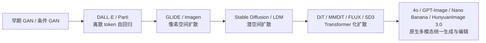
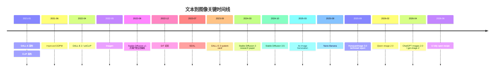
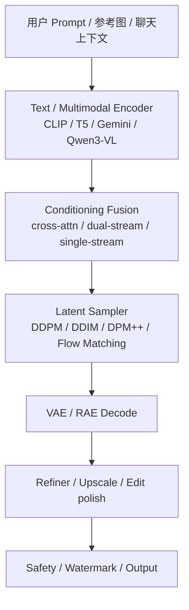

## Executive Summary

过去五年，图像生成（image generation）的主线演化非常清晰：从 **离散 token 自回归（autoregressive over discrete image tokens）** 的 DALL·E/Parti 路线，转向 **像素空间扩散（pixel-space diffusion）** 的 GLIDE/Imagen，再转向 **潜空间扩散（latent diffusion）** 的 Stable Diffusion，随后进入 **Diffusion Transformer 与双流多模态 Transformer** 的 DiT、MMDiT、FLUX/SD3/SD3.5 阶段；到 2025–2026 年，又进一步走向 **原生多模态统一模型（native multimodal / unified generation-and-editing）**，典型代表是 OpenAI 的 4o / `gpt-image-*` 系列、Google 的 Nano Banana / Nano Banana Pro，以及 HunyuanImage 3.0、Qwen-Image-2.0 等“理解—编辑—生成”一体化模型。高层趋势不是“单纯提高清晰度”，而是把 **文本遵循（prompt adherence）**、**文本渲染（text rendering）**、**多图融合（multi-image fusion）**、**一致性编辑（consistent editing）** 和 **世界知识驱动的图像生成** 作为新的竞争主轴。

从系统公开度看，当前生态已经明显分成三层。第一层是 **论文与权重都相对开放** 的开源/开放权重体系，以 Stable Diffusion、SDXL、SD3/3.5、HiDream-I1、Z-Image、i1 为代表，研究者可以复现实验、做 LoRA、DreamBooth、ControlNet 和蒸馏加速。第二层是 **论文部分公开但权重不完整或服务侧封闭** 的体系，如 Imagen、早期 DALL·E 2/3。第三层是 **产品很强但技术栈高度黑箱** 的闭源商业系统，如 Midjourney、现行 OpenAI GPT-image 线上服务、Google Nano Banana Pro 的服务侧实现。工程上，真正决定可用性的不是“会不会生成图”，而是 **显存占用、采样步数、量化可行性、可编辑性、长文本排版能力和安全对齐成本**。

在用户要求特别点名的系统中，**CLIP** 不是图像生成器，但它定义了后续生成模型的“语义监督接口”；**DALL·E** 奠定了“文本—图像联合 token 化、自回归生成”的最早大规模范式；**DALL·E 2** 把问题分解成“文本到 CLIP 图像嵌入的 prior + 图像扩散解码器”，结构上与后来的 many-to-one latent generative pipeline 高度同构；**DALL·E 3** 通过 recaptioning 与提示重写显著改善文本遵循；**Stable Diffusion** 通过 latent diffusion 把推理成本降到消费级 GPU 可承受区间，形成今天最成熟的开源生态；**Midjourney** 则在极少公开技术细节的前提下，以强审美先验和高度产品化流程占据“视觉偏好”高地；**Nano Banana** 与 **Nano Banana Pro** 标志着 Gemini 系从“理解模型附带生图能力”走向“原生可编辑图像模型”；而用户提到的 **NanoGPT** 与 **GPT-Gen** 都存在指代歧义，必须分别澄清。

本报告的核心判断是：**2026 年前沿图像生成已经从“单轮文本到图像”进入“多模态上下文中的可交互视觉生成”阶段**。对于研究者，最值得投入的方向是：高质量数据配比、文本渲染与布局、统一生成/编辑架构、推理加速、评测从 FID 向人偏好与任务性评测迁移，以及安全与版权治理的可验证化。对于工程师，最现实的选择通常不是“追最新最强模型”，而是在 **开放度、成本、时延、可控性和法务约束** 之间做组合设计：开源底座用于可控生产，闭源 API 用于高精度文字排版、复杂编辑或高端商业素材。

## 技术谱系与核心范式

图像生成的现代谱系可以概括为四条主线并行演化。最早的可扩展主线是 **GAN 系**，但 GAN 在文本到图像场景里长期受困于 mode collapse、多对象组合能力弱和训练不稳定；随后 **离散视觉 token 的自回归 Transformer** 成为第一波真正“通用文本到图像”的大型语言模型路线，DALL·E 与后来的 Parti 都属于这一类；第三条主线是 **扩散模型（diffusion models）**，它在样本质量、训练稳定性和可扩展性上取得决定性胜利；第四条则是 **统一多模态模型**，它把图像生成视为更大多模态 token 空间中的一种输出方式，而不是独立的生成器。2021–2024 的产业主导权转换，本质是从“AR 首次证明可行”转向“diffusion 在质量/可控性/工程性上全面胜出”；2025–2026 则开始从“diffusion 专用模型”过渡到“原生多模态统一引擎”。

从数学对象上看，CLIP 解决的是 **对齐（alignment）**，扩散模型解决的是 **采样（sampling）**。CLIP 训练一个图像编码器 \(f_\theta(x)\) 和一个文本编码器 \(g_\phi(t)\)，对 batch 内正样本对最大化相似度、对负样本最小化相似度，典型目标是双向 InfoNCE：
\[
L_{\text{CLIP}}
=
\frac12\Big(
\mathrm{CE}(\tau f(x)g(t)^\top, y)
+
\mathrm{CE}(\tau g(t)f(x)^\top, y)
\Big)
\]
其中 \(\tau\) 是可学习 temperature。CLIP 的关键价值，不是“生成”，而是建立了一个可迁移的语义空间，后续 DALL·E 2 的 unCLIP prior、Stable Diffusion 的文本条件化、开源过滤数据（如 LAION 的 CLIP filtering）都直接或间接依赖这条路线。

扩散模型的标准 DDPM 形式则把数据样本 \(x_0\) 逐步加噪到 \(x_t\)，训练网络去预测噪声或速度项。最常见的噪声预测目标可写为：
\[
L_\epsilon=\mathbb{E}_{x_0,\epsilon,t}\left[
\left\|
\epsilon-\epsilon_\theta(x_t,t,c)
\right\|_2^2
\right]
\]
其中 \(c\) 是文本或其它条件。条件生成里的核心技巧是 **classifier-free guidance, CFG**：
\[
\hat \epsilon
=
\epsilon_\theta(x_t,t,\varnothing)
+
s\cdot
\left(
\epsilon_\theta(x_t,t,c)-\epsilon_\theta(x_t,t,\varnothing)
\right)
\]
\(s\) 为 guidance scale。CFG 让质量与多样性之间可以在采样时调节，因此几乎成为 2022–2025 主流文本到图像扩散系统的缺省组件。

潜空间扩散（latent diffusion）的突破点在于：不直接在像素空间上做去噪，而是先用 autoencoder / VAE 把图像压到更低维 latent，再在 latent 中扩散与采样。这样可以把计算复杂度和显存开销降一个数量级，成为 Stable Diffusion 能在消费级 GPU 上普及的关键。到 SDXL 和 SD3，架构进一步从 U-Net 主干向更强的 cross-attention、双文本编码器、DiT/MMDiT 演化；到 SD3/SD3.5、FLUX、Qwen-Image 和 HiDream-I1，主干又开始从“卷积 + 注意力混合体”转向 **纯或近纯 Transformer 化**、**双流/单流多模态 token 交互**、**MoE 或稀疏化**。

另一个 2024–2026 的显著转向是 **扩散目标自身的替换与统一**。Stable Diffusion 3 采用了 **Rectified Flow / Flow Matching 风格** 的建模和 MMDiT 架构；同阶段的许多工作开始把速度优化从简单 scheduler 调优升级为 **consistency distillation、adversarial diffusion distillation、distribution matching distillation** 等 teacher–student 路线。由此，真实系统比较的重要维度不再只是“参数越大越好”，而是“给定预算下，几步采样能达到多少偏好分数与排版质量”。这也是为什么 “Turbo / Lightning / LCM / ADD / DMD2 / Z-Image-Turbo” 成为近年工程落地的高频关键词。



上图对应的是“主导范式”的迁移，而不是互斥替代。到 2026 年，自回归、扩散、掩码生成（masked generation）和统一多模态 AR 仍在并行发展；例如 Muse 证明了离散 token + masked Transformer 在效率上很有竞争力，HunyuanImage 3.0 则把理解与生成统一到 autoregressive 框架中，说明“扩散最终一统天下”并不是已定结论。

## 代表系统与模型家族深度剖析

**CLIP**。OpenAI 在 2021 年发布 CLIP，使用 4 亿对互联网图文对进行训练，在 30 多个下游视觉数据集上做零样本迁移；其官方结论之一是，CLIP 的 zero-shot ImageNet 表现可与原始 ResNet-50 的监督训练结果相匹配。技术栈方面，官方开源仓库基于 PyTorch，主流复现实现在 `openai/CLIP` 与 `mlfoundations/open_clip` 两条线上发展；后者又扩展到 LAION-400M、LAION-2B、DataComp-1B 等更开放的数据规模。CLIP 本身不生成图像，但它构成了 DALL·E 2、Stable Diffusion 数据过滤、文本图像检索、奖励模型与评测（如 CLIPScore）的共同底座。局限在于：CLIP 训练数据“未过滤且未精修”，官方论文明确指出其会学习到社会偏见。

**DALL·E 1**。OpenAI 将其描述为“12B 参数的 GPT-3 版本”，在 2.5 亿图文对上训练，采用离散 VAE（dVAE）把图像压成 token，再与文本 token 一起做 decoder-only 自回归建模。官方总结的实现要点包括：单流 1280 token 序列、64 层 self-attention、图像 token 稀疏注意力模式，以及 CLIP 在候选样本重排序中的配合作用。该路线的优势是概念组合和零样本合成能力被首次大规模证明；缺点是推理昂贵，图像长程一致性和高保真仍受限，且标准 benchmark 披露有限。官方并未提供完整开源实现，但社区衍生了 minDALL、DALL·E Mini 等近似复现。

**DALL·E 2 与 unCLIP**。DALL·E 2 不再直接“文本到像素”，而是分解为两阶段：先由 prior 把文本映射到 CLIP 图像嵌入，再由扩散 decoder 从该嵌入解码图像。OpenAI 官方把这一结构称为 “hierarchical text-conditional image generation with CLIP latents”，并指出显式生成图像表征有助于提升多样性、同时仅轻微损失写实度与 caption similarity。与 DALL·E 1 相比，官方产品页给出的用户偏好评测是：DALL·E 2 在 caption matching 上比 DALL·E 1 高 71.7%，在 photorealism 上高 88.8%。训练数据规模与完整参数配置在一手公开材料中并未完全透明化，因此对其“总参数量”的二手传播数字应谨慎使用。算法上，DALL·E 2 的关键不是单一 decoder，而是 **CLIP latent prior + diffusion decoder** 这一中间表示分解。安全方面，OpenAI 在预览阶段就重点讨论了偏见、名人/人脸、露骨内容与误导性图像风险，并通过更严格的过滤和部署侧拒绝策略做缓解。

**DALL·E 3**。DALL·E 3 的核心创新并非公开更强 backbone，而是 **better captions / recaptioning**：用高度描述性的合成 captions（descriptive synthetic captions）重标注训练图像，以明显提升 prompt fidelity。OpenAI 的技术报告将重点放在“更好的 captions 如何改善 prompt following”，系统卡则强调其相对 DALL·E 2 的 caption fidelity 和图像质量提升；同时，OpenAI 也明确承认该系统在有害图像、越狱、风格/版权边界、误导性人物图像等方面需要多层缓解。到 2025 年 4o native image generation 发布时，OpenAI 又明确表示 4o 的图像生成能力“显著强于其早期 DALL·E 3 系列模型”，说明 DALL·E 3 更像是 GPT-image / 4o 时代前的过渡高峰。官方没有公开完整参数规模、训练数据细目和推理图谱，因此研究复现主要依赖社区解读而非官方 weights。

**OpenAI ImageGen / GPT-Gen / GPT-image 线**。用户提到的 “ImageGen” 与 “GPT-Gen” 在公开材料中并不是单一、稳定的官方模型名，更接近 **OpenAI 图像生成产品线的俗称**。以当前官方文档为准：OpenAI 的 Image API 已进入 `gpt-image-1`、`gpt-image-2` 阶段；其中 `gpt-image-1` 被官方定义为“原生多模态语言模型（natively multimodal language model），输入文本和图像，输出图像”，`gpt-image-2` 则被定义为“当前最强、快速、高质量的图像生成与编辑模型”。2025 年 3 月，OpenAI 先发布了 **4o Image Generation**，强调其在文本渲染、复杂指令跟随、利用聊天上下文与图像输入变换方面优于 DALL·E 3；2026 年 4 月又发布 **ChatGPT Images 2.0 / gpt-image-2**，继续强化多语言文本渲染、复杂版式、漫画/信息图等“功能性图像”。训练细节、参数规模、优化器和采样器并未像论文时代那样公开，因此这条线更适合被理解为“**从 DALL·E family 过渡到 native multimodal image models**”的产品演进，而不是一篇可完全复现的论文系统。

**Google Imagen / ImageGen 线**。如果把用户提到的 “ImageGen” 理解为 Google 侧文献传统，则对应的是 **Imagen family**；如果理解为近年的产品命名，则 Google 更常把它并入 Gemini API 的 image generation 文档。Imagen 论文提出：强大的 text encoder 对文本到图像质量影响非常大，甚至“通用大语言模型的语言理解能力”比更复杂的图像 backbone 更关键。论文公开的关键信息包括：使用约 4.6 亿内部图文对加上 LAION-400M，使用 T5-XXL 作为强文本编码器，并在 COCO 上取得 7.27 的 zero-shot FID；同时采用级联超分辨率扩散链。Imagen 3 作为产品化继承者于 2024 年公开推出，Google 官方称其为最高质量文本到图像模型，并在开发者生态中把它作为 Vertex / Gemini API 的图像 API 之一。需要注意的是：Google 并未像开源体系那样公开 Imagen 3 的端到端权重与训练代码，更多公开的是产品能力、benchmark 宣称和 API 接入。

**Nano Banana / Nano Banana Pro**。Google 现行官方文档已经把命名解释得很清楚：**Nano Banana = Gemini 2.5 Flash Image**，定位是“高吞吐、低时延”的原生图像生成与编辑模型；**Nano Banana 2 = Gemini 3.1 Flash Image**；**Nano Banana Pro = Gemini 3 Pro Image**，定位是更高保真、带 reasoning / Google Search grounding 的专业视觉资产生成模型。2.5 Flash Image 官方文档强调其 1024px 输出、低时延、高吞吐和对多图融合、角色一致性、精确局部编辑的支持；Google Developers Blog 则把其价格公开为每图约 0.039 美元，并强调 SynthID 隐形水印。Nano Banana Pro 进一步把“世界知识 + grounding + 高质量文本渲染 + 2K/4K 输出 + 多人物/多shot一致性”作为卖点，但截至当前，Google 未公开其完整架构参数与训练 recipe。

**Stable Diffusion family**。Stable Diffusion 的里程碑意义在于把 latent diffusion 变成了真正开放、可大规模二次开发的生态。v1.x 模型卡说明其训练数据来自 LAION-2B(en) 及其子集，使用冻结的 CLIP ViT-L/14 作为文本条件编码器；v2.x 则升级到 LAION-5B 及其过滤子集。官方仓库和 Hugging Face 文档都把 Stable Diffusion 定义为“在 latent space 中训练的 text-to-image diffusion model”，这一路线直接催生了 DreamBooth、LoRA、ControlNet、WebUI、ComfyUI 与 Diffusers 的庞大工具链。优点是开放、可控、生态广；缺点是对训练数据质量极度敏感，且开源模型的安全对齐、偏见控制和版权边界通常弱于闭源商业产品。

**SDXL 与 SD3/SD3.5**。SDXL 代表 Stable Diffusion 从“消费级 baseline”走向“开放高质量旗舰”的阶段：官方披露其 base model 为 3.5B 参数，ensemble pipeline 为 6.6B 参数，并在结构上采用双文本编码器与 refiner 两阶段流水线。SD3 进一步转入 **MMDiT + rectified flow** 路线，Stability AI 明确称其 MMDiT 为“图像与语言各自独立权重、在注意力层双向交互”的多模态 Transformer；Hugging Face 集成页公开说明 SD3 Medium 约 2B 参数。SD3.5 又公开为 Large 8.1B、Medium 2.5B，并在官方参考实现中披露其使用 OpenAI CLIP-L/14、OpenCLIP bigG、Google T5-XXL 三套文本编码器，以及 16-channel VAE。与前代相比，SD3/3.5 在 typography、prompt adherence 和多主体组合上更强，但代价是显存、加载和推理成本显著上升，所以量化与 few-step distillation 变得十分关键。

**Midjourney**。截至 2026 年 6 月，Midjourney 仍然是能力极强但技术细节最不透明的主流图像系统之一。官方文档公开的，是版本历史、参数控制方式和产品行为，而不是论文级架构说明：例如官方确认 V4 是全新代码库与全新 AI architecture，并在新的 supercluster 上训练；最新文档显示 V8.1 于 2026 年 4 月 30 日上线、2026 年 6 月 10 日成为默认版本，并且标准任务渲染速度约为更早版本的 4–5 倍。Midjourney 在多年来持续把 prompt adherence、默认风格化（stylization）、upscaler、variation、personalization 绑定为一套产品体验，但官方没有公开参数规模、训练数据来源、优化器、采样器或具体 backbone。因而对 Midjourney 的技术分析必须严格区分：**可确认的只有官方产品行为与版本描述；内部算法实现未公开。**

**NanoGPT 的歧义澄清**。用户点到 “NanoGPT/NanoBanana” 时，必须特别说明：**Nano Banana** 是 Google 官方的图像模型别名；而 **NanoGPT** 并不是当前主流学术图像生成 foundation model 的正式名字。检索结果显示，“NanoGPT” 至少存在三种不同含义：一是 Andrej Karpathy 的最小 GPT 训练代码传统；二是一个提供 OpenAI-compatible image generation endpoint 的模型路由/聚合服务；三是受 nanoGPT 风格启发的极简扩散实现，如 `nanoDiffusion`。因此，若讨论“图像生成模型”的主流谱系，NanoGPT 不宜与 DALL·E、Stable Diffusion、Midjourney、Nano Banana 并列为同层级基础模型；更准确的表述是：它要么是 **LLM 极简代码范式**，要么是 **服务/API 聚合器**，要么是 **小型教学型扩散实现的命名来源**。



时间线里的每个节点都对应一次范式推进：从“会生图”到“会跟指令”，再到“会编辑、多图融合、长文本排版、上下文一致性与知识化生成”。其中 2025–2026 的节点尤其关键，因为它们标志着文本到图像系统从单一生成器进化为更大的多模态交互平台。

### 代表系统对比表

| 系统/家族 | 首次关键公开 | 主技术路线 | 公开参数规模 | 训练数据公开度 | 公开速度/采样信息 | 公开 benchmark / 亮点 | 开放性 |
|---|---|---:|---:|---|---|---|---|
| CLIP | 2021 | 双塔对比学习 | 未在官方页汇总单一总参 | 400M 图文对 | 非生成模型 | zero-shot ImageNet 接近 RN50 监督基线 | 代码/权重开放 |
| DALL·E 1 | 2021 | dVAE + 自回归 Transformer | 12B | 250M 图文对 | AR 采样，代价高 | 概念组合、零样本合成 | 官方未开权重 |
| DALL·E 2 | 2022 | CLIP prior + diffusion decoder | 公开材料未完整披露 | 细节未完全公开 | 扩散采样 | 相对 DALL·E 1：caption matching +71.7%，photorealism +88.8% | 官方未开权重 |
| DALL·E 3 | 2023 | 强化 recaptioning 的文本到图像系统 | 未披露 | 细节未披露 | 服务侧黑箱 | prompt following 明显增强 | 官方未开权重 |
| 4o / gpt-image-2 | 2025–2026 | 原生多模态图像生成/编辑 | 未披露 | 未披露 | `gpt-image-2` 官方标为 fast/high-quality | 强文字渲染、复杂编辑、版式与多语言 | API 闭源 |
| Imagen / Imagen 3 | 2022–2024 | 强文本编码器 + 级联扩散 | Imagen 论文未以单一总参数口径宣传 | 460M 内部 + LAION-400M | 级联扩散 | COCO zero-shot FID 7.27；Imagen 3 为 Google 最高质量 T2I | 权重未公开 |
| Nano Banana | 2025 | Gemini 2.5 Flash Image 原生图像生成 | 未披露 | 未披露 | 1024px、低时延/高吞吐 | 多图融合、角色一致性、局部编辑 | API 闭源 |
| Nano Banana Pro | 2026 | Gemini 3 Pro Image | 未披露 | 未披露 | 支持 2K/4K 输出 | 更强文字渲染、world knowledge、grounding | API 闭源 |
| Midjourney V8.1 | 2026 | 闭源产品化图像系统 | 未披露 | 未披露 | 官方称较早版本快 4–5 倍 | 审美偏好强、产品化成熟 | 完全闭源 |
| Stable Diffusion v1.5 | 2022 | Latent Diffusion + CLIP text encoder | 常用公开口径约 0.9B 级，但官方页更强调路线而非总参 | LAION-2B(en) 子集 | 常见 20–50 step | 开源生态成熟 | 权重开放 |
| SDXL 1.0 | 2023 | 更大 LDM + 双文本编码器 + refiner | 3.5B base / 6.6B ensemble | 细节部分公开 | base+refiner 流水线 | 高分辨率、用户偏好显著优于 SD1.5/2.1 | 权重开放 |
| SD3 / SD3.5 | 2024 | MMDiT + rectified flow | SD3 Medium 2B；SD3.5 Medium 2.5B；Large 8.1B | 细节部分公开 | Turbo 可 4 step | typography、prompt adherence 强 | 多数权重开放/门控 |

表中参数、数据与 benchmark 仅填写“官方或论文明确公开口径”；对 DALL·E 3、GPT-image、Midjourney、Nano Banana Pro 等未充分披露项，一律标记为“未披露”，而不采用二手流传数字。对应来源分别来自 OpenAI、Google、Stability AI 的官方论文、模型卡、系统卡、SDK/模型文档与官方产品页。

## 工程实现、采样流程与优化实践

从工程角度看，今天大多数可复用图像生成系统都可以抽象成同一个流水线：**文本编码 → 条件融合 → latent 初始化/采样 → VAE 解码 → 可选 refiner / safety / post-processing**。CLIP、T5、Gemini/Qwen3-VL 这类文本或多模态编码器负责把 prompt、多图条件或编辑上下文映射到条件表征；扩散主干（U-Net、DiT、MMDiT、稀疏 DiT 等）负责在 latent 中逐步去噪或做 flow matching；VAE/RAE 负责像素与潜空间互转；部署时再加上 moderation、watermark、seed 管理和缓存。对于原生多模态系统，这条链条还会插入“对话上下文重写”“检索/grounding”“图像编辑掩码推断”等服务侧步骤。



在开源生态里，**PyTorch + Diffusers + Transformers + Accelerate** 已经成为事实标准。Hugging Face 文档把 pipeline 抽象为若干独立训练和推理模块：text encoder、UNet/Transformer、VAE、scheduler；而 SD3/SD3.5 文档进一步说明它们可以通过带三个 text encoders 的 SD3 pipeline 运行。对开发者而言，这种模块化意味着：同一套工程里可以替换 scheduler、插 LoRA、加 ControlNet、做 quantization，而不必重训底座。

下面给出一个 **Stable Diffusion / SDXL / SD3.5 风格** 的最小可运行示意。其关键工程点不是代码行数，而是：`torch_dtype`、模型权重拆分、offload、scheduler 选择，以及是否在 transformer/UNet 层启用 LoRA 与量化。相关用法均有 Diffusers 和 Stability AI/Hugging Face 官方集成文档支持。

```python
import torch
from diffusers import StableDiffusion3Pipeline

model_id = "stabilityai/stable-diffusion-3.5-large"

pipe = StableDiffusion3Pipeline.from_pretrained(
    model_id,
    torch_dtype=torch.bfloat16  # A100/H100 常用；消费级卡可改 fp16
)
pipe.enable_model_cpu_offload()     # 减少显存峰值
pipe.enable_attention_slicing()     # 进一步降显存

prompt = "一个中文科普信息图，标题清晰、版式规整，展示扩散模型采样流程"

image = pipe(
    prompt=prompt,
    negative_prompt="blurry, low quality, distorted text",
    num_inference_steps=28,
    guidance_scale=7.0,
    height=1024,
    width=1024,
).images[0]

image.save("sd35_infographic.png")
```

如果目标是 **个性化微调（personalization）**，当前最实用的组合仍是 **LoRA + DreamBooth + 低步数蒸馏**。DreamBooth 用少量主体图像建立“唯一 token 与主体外观的绑定”，LoRA 则把全量微调压缩为低秩适配，显著降低显存与训练参数规模；ControlNet 和 IP-Adapter 则分别解决“结构控制”与“图像提示（image prompt）”问题。它们的实际价值在于：把“通用底座模型”改造成“品牌、人像、商品、版式、姿态、草图”等任务的专业系统，而不是重新训练全模型。

```python
# 以 Diffusers 为例的 LoRA 加载思路（示意）
import torch
from diffusers import AutoPipelineForText2Image

base = AutoPipelineForText2Image.from_pretrained(
    "stabilityai/stable-diffusion-xl-base-1.0",
    torch_dtype=torch.float16
).to("cuda")

# 假设已训练好 LoRA 权重
base.load_lora_weights("./my_brand_lora", weight_name="pytorch_lora_weights.safetensors")
base.fuse_lora()  # 部署期可融合，减小运行时开销

img = base(
    "极简海报，品牌色一致，中文标题清晰，几何构图",
    num_inference_steps=20,
    guidance_scale=6.5
).images[0]
img.save("brand_poster.png")
```

推理加速的主线已经从“改 scheduler”进入“改目标函数 + teacher-student 蒸馏”。在实际部署中，LCM 可把高分辨率 latent diffusion 压到 2–4 步，ADD/LADD 可把 foundation diffusion 压到 1–4 步，DMD/DMD2 与 Lightning/Turbo 路线则继续追求 one-step 或 ultra-few-step。对工程师而言，这些方法并不只是“学术提速”：它们直接决定 API 成本、峰值吞吐和交互式编辑可用性。对应代价是，步数压得越低，通常越需要更严格的数据蒸馏、对抗损失或奖励/偏好后训练来补偿质量下降。

当前主要工程瓶颈可概括为四类。第一是 **显存与加载成本**：SD3.5 Large、HiDream-I1 这类大型语言模型即使不训练，仅推理也常需要高显存或强量化；官方与社区材料都显示，量化、CPU offload、attention slicing、single-file loading 对实际可用性极其关键。第二是 **文字排版与长文本渲染**：许多系统在短文本 logo 上进步明显，但真正的段落级版式仍不稳定。第三是 **多图一致性**：角色一致性、Logo 保真、参考图融合到复杂场景都需要强得多的训练数据与 condition interface。第四是 **安全与法务**：开源模型在版权、深度伪造、水印和有害内容上的治理远弱于服务端模型。

## 评测体系、Benchmark 与当前竞争格局

图像生成评测已经不再适合只看 **FID（Fréchet Inception Distance）** 和 **IS（Inception Score）**。FID 仍然适合评估分布级质量，特别是 class-conditional 或无条件生成，但它对文本到图像最关键的“是否按 prompt 生成”并不敏感。CLIPScore 则能衡量图文一致性，但更偏全局语义匹配，难以发现对象数量、空间关系、属性绑定等细粒度错误。近几年评测的方向性变化，是从“感知质量”走向“**任务一致性 + 人类偏好 + 细粒度合成能力**”。GenEval、T2I-CompBench、HPS v2、GenAI-Bench、DrawBench、EditBench、ImagenWorld 正是这一迁移的代表。

在公开 benchmark 中，**Imagen** 论文给出的里程碑结果是 COCO zero-shot FID 7.27；这代表了“强文本编码器 + 级联扩散”时代的高峰之一。**GenEval** 关注对象共现、位置、数量和颜色等组合属性，适合衡量新一代模型是否真正理解 prompt 的结构；**T2I-CompBench** 则系统覆盖属性绑定、关系与复杂组合。**HPS v2** 与后续 rich human feedback 系工作，把“人类真实偏好”的信号显式引入评测乃至训练后优化。一个重要现实是：即便到 2026 年，很多模型在复杂空间关系、计数和长文本版式上仍然不稳，这也是闭源/开源都在重点投入的数据和后训练方向。

在“当前格局”上，可以做出一个保守但高置信度的判断：**闭源产品在综合能力上整体领先，开放模型在可控部署与研究复现上领先**。Google 官方将 Imagen 3 定位为其最高质量文本到图像系统；2025 年 Google 开发者博客又把 Gemini 2.5 Flash Image/Nano Banana 定位为 state-of-the-art image generation and editing model。OpenAI 在 2025–2026 连续用 4o image generation、`gpt-image-2` 和 ChatGPT Images 2.0 强调其在文字渲染、复杂编辑和版式方面的领先。Stability AI 则把 SD3/3.5 的核心卖点放在 typography、prompt adherence 与可定制性上。Midjourney 则在产品层面持续强化默认审美和创作流畅度。由于各家采用的评测集合、Elo 体系和人评协议并不统一，跨厂商“绝对排名”应谨慎解释；更可靠的比较方式，是按 **任务维度** 看谁擅长：排版/编辑/广告资产/艺术审美/可控工作流/本地可部署。

对研究与落地更有价值的，不是问“谁第一”，而是看 **每类系统的优势边界**。如果任务是高质量中文/多语言 logo、海报、菜单、漫画页面、信息图，则 OpenAI GPT-image 和 Google Nano Banana Pro 这类原生多模态服务通常更有优势；如果任务是本地化部署、可控工作流、私有化微调、多条件组合和研究复现，Stable Diffusion/SDXL/SD3.5 及其生态仍是首选；如果目标是风格化创作和高审美探索，Midjourney 仍是强产品；如果目标是前沿开放研究，HiDream-I1、Z-Image、i1、Qwen-Image-2.0、HunyuanImage 3.0 代表了 2025–2026 的开源前沿。

## 重要论文与近年研究进展

下面给出一份研究价值较高、且与本报告主题直接相关的论文 / 技术报告清单。为避免把“论文罗列”写成无差别书单，下列每篇都附一句定位性点评。

1. **CLIP: Learning Transferable Visual Models From Natural Language Supervision**。定义图文对比学习的工业基线，也是后来 image-text filtering、生成评测与驱动 prior 的语义基石。  
2. **DALL·E: Zero-Shot Text-to-Image Generation**。首次把大规模离散视觉 token 自回归路线证明到产业级影响力。  
3. **DDPM**。把 diffusion 从理论兴趣点变成高质量图像生成范式。  
4. **Improved DDPM**。学习反向方差、减少采样步数，极大推动了扩散部署可行性。  
5. **Classifier-Free Guidance**。条件扩散几乎所有主流系统的默认采样技巧。  
6. **GLIDE**。把文本指导扩散与编辑能力结合，是 DALL·E 2 之前的关键过渡。  
7. **Hierarchical Text-Conditional Image Generation with CLIP Latents**。即 DALL·E 2 / unCLIP 的核心论文，证明 intermediate semantic representation 的价值。  
8. **Photorealistic Text-to-Image Diffusion Models with Deep Language Understanding**。Imagen 代表作，凸显强 text encoder 的决定性作用。  
9. **High-Resolution Image Synthesis with Latent Diffusion Models**。Stable Diffusion 背后最关键的方法论文。  
10. **Scalable Diffusion Models with Transformers**。DiT 路线奠基，说明 Transformer 主干可随算力平滑扩展。  
11. **SDXL: Improving Latent Diffusion Models for High-Resolution Image Synthesis**。把开放图像模型推进到高分辨率、双文本编码器与 refiner 体系。  
12. **Improving Image Generation with Better Captions**。DALL·E 3 的关键技术报告，说明 recaptioning 对 prompt fidelity 的巨大影响。  
13. **Muse: Text-to-Image Generation via Masked Generative Transformers**。证明 masked token generation 不是过时路线，而是可与 diffusion 竞争的高效率方案。  
14. **Parti**。大型自回归文本到图像的代表，强调世界知识与复杂构图。  
15. **DreamBooth**。个体主体驱动生成的标准方法之一，推动消费级个性化生成爆发。  
16. **ControlNet**。用零卷积把“结构控制”接到预训练扩散底座上，是可控生成生态的里程碑。  
17. **IP-Adapter**。以轻量 adapter 接入图像 prompt，低成本实现参考图驱动生成。  
18. **Latent Consistency Models**。few-step latent generation 的标志性方法。  
19. **Adversarial Diffusion Distillation**。foundation diffusion 实现 1–4 步高质量采样的重要蒸馏路线。  
20. **One-step Diffusion with Distribution Matching Distillation / DMD**。从分布匹配角度构建 one-step student generator。  
21. **Stable Diffusion 3: Scaling Rectified Flow Transformers for High-Resolution Image Synthesis**。MMDiT + rectified flow 的代表作。  
22. **HiDream-I1**。17B 稀疏 DiT + 动态 MoE，代表 2025 开源高端图像模型。  
23. **HunyuanImage 3.0 Technical Report**。把理解与生成统一在 autoregressive 原生多模态框架下。  
24. **Qwen-Image-2.0 Technical Report**。聚焦高保真、编辑统一、多语言长文本渲染。  
25. **Z-Image**。6B 单流 Diffusion Transformer，以更低算力逼近前沿效果，并给出 Turbo/consumer 兼容路线。  
26. **i1: A Simple and Fully Open Recipe for Strong Text-to-Image Models**。2026 年非常重要的“全公开 recipe”工作，强调公开训练数据与完整设计空间消融。  
27. **GenEval**。把对象级、关系级合成能力变成更细粒度可评测对象。  
28. **T2I-CompBench**。系统化地评估属性绑定、关系和复杂组合。  
29. **HPS v2 / Better Aligning Text-to-Image Models with Human Preference**。从人类偏好角度重塑评测与对齐目标。  
30. **ImagenWorld**。2026 年对真实生成/编辑任务进行更全面压力测试的新 benchmark。  

2025–2026 的最新研究进展可以概括为五点。第一，**统一生成与编辑** 成为标准需求，Qwen-Image-2.0、HunyuanImage 3.0、FLUX.1 Kontext 都强调 generation + editing 的统一框架。第二，**文本渲染和多语言排版** 被单独当成数据管线与后训练重点，而不再被视为“顺带学会”的能力。第三，**大型语言模型稀疏化 / MoE / 单流结构** 被用来降低高端模型的推理成本，如 HiDream-I1 与 Z-Image。第四，**RAE / 更强潜空间表示** 正在挑战 classic VAE，试图把理解与生成放到更共享的 latent 中。第五，**全开放 recipe** 成为研究社区迫切需求，i1 的价值就在于它不仅开权重，还公开数据处理与大规模消融。

## 研究者与工程师建议清单

对研究者，短期最值得落地的实验有三类。其一，围绕 **文本渲染与布局** 做小规模高质量数据混配实验，优先比较原始 caption、recaptioned caption、结构化 caption 三种配方对长文本排版和信息图生成的影响。其二，在开放底座上系统比较 **LoRA、DreamBooth、IP-Adapter、ControlNet** 的协同收益，特别是“少样本个性化 + 版式控制”的组合。其三，做 **few-step 蒸馏** 与 **评测联动**，不要只看 FID，而要同时看 GenEval、T2I-CompBench、HPS 或至少人工偏好。

对工程师，短期方案不应盲目追逐最强闭源 API，而应先按业务拆解。若业务重点是 **私有化、可控工作流、企业内网部署**，优先选 SDXL/SD3.5 生态；若重点是 **高质量文字渲染、复杂编辑、多图融合与市场素材生产**，优先评估 `gpt-image-2` 与 Nano Banana Pro；若重点是 **创意审美探索**，Midjourney 仍值得纳入 A/B 流程。实际系统设计建议采用“双底座”架构：开放模型做草图、批量生成、隐私任务；闭源服务做 final polish、文字排版和高等级编辑。这样最符合今天图像生成领域“开放度与能力不总是同向”的现实。

在数据和算力估算上，可以给出一个保守分层建议。**LoRA 级个性化/风格化微调**：通常数十到数百张高质量图即可启动，A100 级或高端消费卡就能完成；**中等规模 domain adaptation**：更适合用数万到数十万图的高质量子集，重点投入数据清洗、caption 重写和评测，而不是一味增广；**从头训练前沿 T2I foundation model**：已明显是大厂/研究联盟级投入，i1 报告公开给出了 700K+ TPU v6e 小时量级，Z-Image 报告公开给出 314K H800 GPU 小时量级，这说明“真正一线底座训练”已经进入数十万美元到更高预算区间。对绝大多数团队，更高 ROI 的路径仍然是 **开放底座 + 数据配方 + adapter/蒸馏 + 严格评测**。

长期研究方向建议集中在五个问题上。第一，**统一理解—编辑—生成** 的单模型设计，减少目前多个模型串联的误差累积。第二，**文本与布局建模**，尤其是多语言、长文本、图表和信息图资产。第三，**高质量开放数据与可验证过滤**，解决版权、非法内容和低质量 captions 的根问题。第四，**可解释评测**，让系统知道自己哪里错，而不仅是得到一个总分。第五，**高效部署**，包括 quantization、稀疏化、few-step distillation 与新的 latent representation。

## 开放问题与局限

本领域最大的现实局限，不是“模型不够强”，而是 **披露严重不对称**。Midjourney、现行 GPT-image、Nano Banana Pro 等最强商用产品，大多只公开产品能力，不公开完整架构、数据配方、参数规模、优化器、训练步骤与系统级过滤细节；因此，对这些系统只能做“基于官方可核验信息的能力综述”，不能像对 SD/DiT/ControlNet 那样做完全可复现实验学分析。

另一个局限是 **跨厂商 benchmark 不统一**。同一个模型在 DrawBench、GenAI-Bench、内部 Elo、人偏好比测、真实业务素材 A/B 中可能排名不同；尤其“审美偏好强”和“严格按说明书生成”并不是同一目标，这也是 Midjourney、Imagen、GPT-image、Stable Diffusion 常被不同用户群给出不同结论的原因。

针对用户要求的两种交付格式，需要如实说明：**本次正文已经采用 Markdown 结构化组织**，并内含 Mermaid 图、流程图、对比表和代码片段；但受当前对话输出形态限制，本轮未直接附带单独的 `.html` 文件附件。若将本文另存为 `.md`，可直接作为 Markdown 版使用；若需要单文件离线 HTML，建议以支持 Mermaid/SVG 内嵌的工具链导出，或将本报告中的 Mermaid 图渲染为内联 SVG 后再封装为单文件 HTML。该限制属于当前交付介质限制，不影响报告中的事实结论与研究判断。
