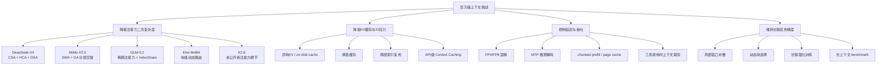
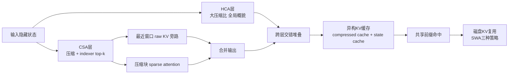

## Executive Summary

本文将用户给出的对象解释为：**DSV4 = DeepSeek-V4**，**MIMOv2.5 = 小米 MiMo-V2.5 系列**，**GLM5.2 = GLM-5.2**，**Kimi = Moonshot 的长上下文技术栈与产品化路线**，**K2.6 = Kimi K2.6 公共模型/API 版本**。其中，只有 DeepSeek-V4、MiMo-V2.5、GLM-5.2 在公开官方材料中**明确宣称 1M 上下文**；Kimi 的公开研究路线已经走到可扩展到 1M 乃至 10M 的注意力方案，但 Moonshot 官方同时明确表示其**做过 1M，却因服务成本过高而未在当时公开提供**；K2.6 当前公开上限仍是 **256K**，并通过自动 context caching 与工具调用时的上下文管理策略弥补部分长程任务需求。

从**架构路径**看，这五个对象代表了四条不同的百万级上下文路线。DeepSeek-V4 走的是“**压缩 + 稀疏 + 局部补偿 + 异构 KV**”路线：CSA/HCA 将序列压缩后再做稀疏或重压缩注意力，并用滑动窗口补回局部精度，属于公开材料里系统细节最完整的一条。MiMo-V2.5 走的是“**SWA + GA 分层交替**”路线，用极小的 128-token 局部窗和固定比例的全局层换取近 6–7 倍 KV 节省，工程上最简单、部署兼容性最好，但本质上是**静态混合注意力**。GLM-5.2 走的是“**基于 DSA/稀疏注意力的跨层索引复用**”路线，即 IndexShare/IndexCache，把“找远程相关 token”的索引器成本在跨层摊薄。Kimi 则更偏“**块级动态稀疏 + 外部缓存**”——MoBA 用 MoE 式路由在块层面做动态稀疏，而 Context Caching 在 API 层做工程性复用；K2.6 则是“**256K 原生上下文 + 自动缓存 + 工具上下文裁剪**”的产品化折中。

若以“**公开可复现度**”排序，DeepSeek-V4 最强：技术报告公开到了 CSA/HCA、RoPE 维度、mixed KV 存储、heterogeneous KV layout、on-disk KV cache 与 SWA 重建策略，连推理目录里的 `config.json` 都给出了 `window_size=128`、`index_topk=1024`、`rope_factor=16`、`compress_ratios` 等实现级参数。MiMo-V2.5 次之：虽然没有一篇专门针对 V2.5/Pro 的完整论文，但 V2-Flash 技术报告、V2.5/Pro 模型卡和 HF 配置已经足够推断其 1M 路线。GLM-5.2 的公开能力宣称很强，但**工程细节最不完整**；其长上下文核心创新 IndexShare 是公开的，然而 KV 布局、位置编码、并行策略等关键实现仍未完整披露。Kimi/K2.6 的研究公开度不低，但其**产品公开上下文上限**仍显著低于 DeepSeek-V4、MiMo-V2.5、GLM-5.2。

若以“**真实 1M agent/coding 可用性**”而非单纯窗口名义判断，GLM-5.2 的官方叙述最强调“Solid 1M”与长程 coding agent 稳定性，文档甚至给出单任务累计处理 **850K tokens** 的工程案例；DeepSeek-V4 也公开展示了 1M 上下文下对 MRCR/CorpusQA 的强表现，但其报告同时承认**128K 以后检索能力开始下降**。MiMo-V2.5-Pro 在 GraphWalks 上给出 512K 与 1M 的成绩，是本组里少数直接给出 1M 推理数值的开源条目之一；不过其注意力本质仍以静态局部窗为主，对“跨百万 token 的任意位置精确跳转”未必天然占优。Kimi 路线在研究上很强，但现阶段对用户最有价值的不是“原生 1M”，而是“MoBA + Context Caching + 具成本意识的产品策略”。

如果目标是**学术研究与复现**，优先建议读 DeepSeek-V4 技术报告与 MiMo-V2-Flash/V2.5 配置；如果目标是**产品选择**：  
一是要**真正开源、1M、实现细节最完整**，首选 DeepSeek-V4；  
二是要**多模态 + 1M + 相对简单的混合注意力**，首选 MiMo-V2.5；  
三是要**长程 coding agent 实战与 API 可用性**，GLM-5.2 很值得优先测试，但要接受公开技术细节不足；  
四是要**Moonshot 生态与工具链**，当前应把 K2.6 看作“256K + cache/compaction”的工程解，而不是原生 1M 模型。

## 研究范围与方法

本报告只采用**官方/一手资料优先**：技术报告、arXiv 官方稿、官方博客、Hugging Face 官方模型卡与配置、官方 API 文档、官方 GitHub README/配置文件。凡官方材料未明确写出的实现细节，本文一律分成三类处理：**已公开**、**代码/配置可推断**、**未公开**。涉及“代码/配置可推断”的地方，我会显式标注“推断”与置信度。

为避免名称歧义，本文对对象作如下界定：  
DeepSeek-V4 对应官方 DeepSeek-V4 系列；MiMo-V2.5 对应小米 MiMo-V2.5 系列，必要时同时讨论 V2.5-Pro，因为 1M 细节主要在 Pro 模型卡中公开；GLM-5.2 对应 Z.ai 官方 GLM-5.2；“Kimi”一章讨论的是 Moonshot 面向长上下文的**技术栈与产品化路线**，即 MoBA 与 Context Caching；“K2.6”一章讨论的是 Moonshot 当前公开的 Kimi K2.6 多模态/agent 模型。

下图给出五个对象在“百万级上下文”上的技术路线抽象。它不是原论文原图，而是依据官方材料抽象出来的对照图。

需要特别指出的是，“**支持 1M**”并不等于“**在 1M 上稳定完成长程任务**”。DeepSeek-V4 报告明确显示其 MRCR 检索在 128K 内更稳定，之后会下降；MiMo-V2.5-Pro 在 GraphWalks 1M 仍有可观分数；GLM-5.2 官方文档强调“Solid 1M”且给出 850K 长程 coding 案例；Moonshot 则明确表示他们做过 1M，但因为服务成本尚不理想，公开产品 K2.6 仍停在 256K。换言之，本报告最终比较的不只是“窗口长度标签”，而是**架构可行性、工程化成本和实际任务稳定性**三者的平衡。

## DeepSeek-V4

### 来源与引用列表

| 资料 | 关键位置 | 用途 |
|---|---|---|
| DeepSeek-V4 技术报告 | Abstract, §2.3, §3.5, §5.2, §6；PDF p.1, p.9–13, p.21–23, p.33, p.44 | 核心架构、工程实现、KV 设计、量化、限制  |
| DeepSeek-V4 官方模型卡 | Introduction, Model Downloads, Long-context eval, local deploy | 1M 支持、模型规格、部署建议  |
| DeepSeek-V4 开源推理配置 `inference/config.json` | 原始 JSON 行 180–245 | 实现级参数：窗口、top-k、RoPE 扩展、压缩比、FP4/FP8 等  |

### 架构与算法细节

DeepSeek-V4 的百万上下文方案不是单一稀疏注意力，而是一个**混合注意力体系**：将 **Compressed Sparse Attention（CSA）** 和 **Heavily Compressed Attention（HCA）** 交错部署。官方报告给出的定义是：CSA 先沿序列方向压缩 KV，再对压缩后的表示应用 DeepSeek Sparse Attention；HCA 则采用更激进的 KV 压缩，但保留稠密注意力。两者交错组合的目的，是在 1M 上下文里同时控制**算力成本**与**信息覆盖范围**。报告的摘要和正文都明确宣称，在 1M 上下文下，DeepSeek-V4-Pro 的单 token 推理 FLOPs 降到 DeepSeek-V3.2 的 **27%**，KV cache 降到 **10%**。

就 CSA 而言，DeepSeek-V4 的关键不是直接对原 token 做 token-level 稀疏，而是先把一段 KV 压缩成“压缩块表示”，再通过一个 **lightning indexer** 对这些压缩块做 **top-k 选择**，最后仅对选择出的压缩块做核心注意力。这个 indexer 还采用低秩查询、压缩后的 indexer key、以及 learnable matrix 的组合来计算分块得分。进一步地，CSA 并不是只靠稀疏远程块；它还在旁路加入一小段**滑动窗口的未压缩 KV**，以弥补局部细粒度依赖。也DeepSeek-V4 的局部/全局拆分不是 Longformer 那种显式局部+全局头，而是“**压缩远程块 + 最近窗口 raw KV**”的双支路。

HCA 则更像是“极端压缩的全局摘要层”。其压缩比比 CSA 更大，不做稀疏选择，而是对压缩后的 KV 直接做共享 KV 的 MQA 核心注意力，并同样配 grouped output projection。这里的设计逻辑很清楚：CSA 负责**有选择地查找远处信息**，HCA 负责**以极低成本保留全局概貌**。因此 DeepSeek-V4 本质上并不是单一路径，而是一种“**分工式混合注意力层栈**”。

位置编码部分，报告明确写出 CSA/HCA 都只对查询、KV、以及核心注意力输出的**最后 64 维**施加 RoPE；同时为了让输出保持相对位置信号，还会对输出侧再施加一次相应位置的 RoPE。换言之，DeepSeek-V4 不是“全维 RoPE”，而是**partial RoPE**。这对 1M 上下文很关键，因为它把高精度位置维保留在有限子空间里，既压缩了 KV 存储，又避免在巨大长度上让全部维度都承担高频旋转。

除了注意力本身，DeepSeek-V4 还在总体结构上保持了 DeepSeekMoE 和 MTP，同时引入 **mHC** 强化残差路径，并使用 **Muon** 优化器。报告全文将“百万上下文可行”归因于三层叠加：**CSA/HCA 架构创新**、**基础设施优化**、以及**计算/存储低精度化**；它不是单纯靠训练时把 RoPE 拉长。

### 工程实现细节与配置摘录

DeepSeek-V4 的工程公开度在本组中最高。技术报告在推理框架部分专门解释了为什么传统 PagedAttention 假设会被其混合注意力打破：一方面，各层 KV cache 大小不同；另一方面 SWA 层和压缩层需要不同的命中/淘汰策略。为此，DeepSeek-V4 设计了**异构 KV cache 布局**：一部分是“经典 KV cache”，存放 CSA/HCA 压缩后的块；另一部分是“state cache”，专门存 SWA 最近窗口与尚未凑满压缩块的尾部 token 状态。这个设计的意义在于，它把“未压缩但短期重要”的部分与“已压缩的长期记忆”显式分层。

报告还公开了 **on-disk KV cache** 方案，用于共享前缀复用。对 CSA/HCA，只需把压缩后的 KV 存盘；命中共享前缀时，直接读回直到最后一个完整压缩块。对 SWA，由于其未压缩 KV 体积约为压缩 KV 的 **8 倍**，DeepSeek-V4 提供了三种策略：**Full SWA Caching、Periodic Checkpointing、Zero SWA Caching**。三者分别在“存储开销”和“重算开销”之间做取舍。这是公开材料里少见的、真正把**磁盘层级缓存**引入 LLM 长上下文推理设计的案例。

在低精度与带宽优化上，DeepSeek-V4 明确采用混合 KV 存储：**RoPE 维用 BF16，其余维用 FP8**，报告称这使 KV cache 体积相较纯 BF16 减少接近一半；同时 lightning indexer 的注意力计算用 **FP4**，后训练阶段又对 MoE 专家权重与 indexer 的 QK 路径使用 **FP4 QAT**。这不是事后量化，而是训练/后训练阶段参与设计的低精度路线。

开源推理配置进一步给出了实现级参数。`window_size=128` 与旁路滑窗完全一致；`index_topk=1024` 表明 CSA 的稀疏压缩块预算很大但仍是常数；`original_seq_len=65536` 加上 `rope_factor=16` 在数值上对应 **1,048,576**，这与 1M 上下文支持高度一致；`rope_head_dim=64` 也吻合论文所说“只对最后 64 维施加 RoPE”；`dtype="fp8"` 与 `expert_dtype="fp4"` 则直接对应报告中的混精设计。配置中的 `compress_ratios` 长数组大量交替出现 `128` 和 `4`，结合论文对 HCA/CSA 的描述，可以**中高置信度推断**：多数层在“重压缩层”和“轻压缩+稀疏层”之间交错，只是官方没有在配置文件注释里显式写出每个 ratio 映射到哪种层类型。

下面给出一个依据技术报告与开源配置抽象出的 DeepSeek-V4 长上下文路径示意。

### 实验结果与评估

DeepSeek-V4 的核心效率声明集中在 1M 场景：Pro 版在 1M 上下文下只需 DeepSeek-V3.2 **27%** 的单 token 推理 FLOPs 和 **10%** 的 KV cache；Flash 版进一步降到 **10% FLOPs / 7% KV**。这组数字的意义不只是更省显存，而是让“原生 1M 上下文”从 demo 级别变成**可例行部署**的成本区间。

能力评估上，官方基础模型结果给出 LongBench-V2：DeepSeek-V4-Pro-Base 为 **51.5**，高于 V3.2-Base 的 **40.2**。后训练模型部分，报告专门声称 DeepSeek-V4-Pro-Max 在 1M 窗口下的合成与真实长上下文场景都很强，甚至在学术基准上超过 Gemini-3.1-Pro。更重要的是，报告并没有掩盖曲线退化：在 MRCR 上，**128K 内稳定，128K 后开始下降，但 1M 时仍明显强于多数对手**。从科研角度看，这比单报一个 1M 点值更可信。

训练与后训练方面，DeepSeek-V4-Flash/Pro 分别在 **32T/33T tokens** 上预训练，然后通过“两阶段后训练范式”完成能力收敛：先独立培养数学、代码、agent、指令等领域专家，再通过 on-policy distillation 做统一整合。这一点与“为了长上下文单独做 RoPE hack”不同；DeepSeek-V4 的长上下文来自基础架构和基础设施，而不是靠后期补丁。

### 优点、限制与未解决问题

DeepSeek-V4 的最大优点是：**公开技术细节最充分**、**1M 原生支持最明确**、**长序列 IO/KV 工程做得最重**。它不仅公开了算法，也公开了“怎么把算法落到存储层、内核层和低精度层”。对于做系统研究、内核研究、KV cache 管理研究的人，这一点非常重要。

但它的代价同样明显。首先，官方在结论里直接承认 V4 为追求极致长上下文效率而采用了**相当复杂**的架构与技巧堆叠；未来版本会尝试做更“elegant”的提炼。其次，虽然论文展示了 1M 能力，但也承认 128K 以后 MRCR 会开始降；因此“1M 可用”并不意味着在所有长程推理形式上都近似无损。再次，部分最关键的层间映射与压缩倍率实现仍需要读开源代码/配置去推断，文稿本身并未将所有实现显式数学化。

### 与其他模型对比小结

与 MiMo-V2.5 相比，DeepSeek-V4 的长上下文能力更像**动态稀疏压缩系统**，而不是静态混合注意力；对无规律远距依赖的表达能力理论上更强，但工程复杂度显著更高。与 GLM-5.2 相比，DeepSeek-V4 公布得更全；GLM-5.2 强在产品和长程 coding 实战叙述，但复现性不如 DeepSeek-V4。与 Kimi/K2.6 相比，DeepSeek-V4 是真正公开原生 1M 的方案，而不是“研究上做过 + 产品上暂缓”或者“256K + cache/compaction”。

## MiMo-V2.5

### 来源与引用列表

| 资料 | 关键位置 | 用途 |
|---|---|---|
| MiMo-V2-Flash 技术报告 | Abstract, §2, p.1, p.5 | V2.5 继承的基础架构：SWA+GA、MTP、256K 扩展路径  |
| MiMo-V2.5-Pro 模型卡 | Introduction, Long-context Eval, Model Summary, SGLang deploy | 1M 能力声明、GraphWalks、部署参数  |
| MiMo-V2.5 模型卡 | LLM backbone, multimodal encoders, training process, deploy | V2.5 多模态结构、1M 训练扩窗路径、部署样例  |
| MiMo-V2.5-Pro `config.json` | 原始 JSON 行 267–390 | 1M positional length、hybrid layer pattern、RoPE、SWA/GA 头配置、FP8 量化  |

### 架构与算法细节

MiMo-V2.5 的百万上下文路线，本质上建立在 MiMo-V2-Flash 已经公开的**Hybrid Sliding Window Attention** 上。V2-Flash 技术报告给出的定义很清楚：模型在层级上交替使用 **Sliding Window Attention（SWA）** 与 **Global Attention（GA）**，滑动窗口固定为 **128 tokens**，V2-Flash 采用 **5:1** 的 SWA:GA 比例，并因此获得接近 **6×** 的 KV cache 与注意力计算节省。MiMo-V2.5 模型卡明确说明其 LLM backbone 继承 V2-Flash 的这一架构；而 V2.5-Pro 进一步把比例改到 **6:1**，同样保持 **128** 的滑窗。

这一路线的特点，是对百万上下文不追求“每层都能自由访问全历史”，而是用多数 SWA 层保留局部演化，仅在少数 GA 层做全局交换。V2-Flash 图中明确写出 8 个 hybrid block，每个 block 由 5 个 SWA block 加 1 个 GA block 组成；V2.5/Pro 的模型卡与配置文件则给出更具体的层数：V2.5 为 **48 层**（39 SWA、9 Full/GA），V2.5-Pro 为 **70 层**（60 SWA、10 Full/GA）。这种结构在工程上极其友好，因为它仍然贴近主流 Transformer runtime，几乎不需要像 DeepSeek-V4 那样重新发明 KV layout。

MiMo-V2.5 系列同时重用 **3 层 MTP**。V2-Flash 报告指出，其 MTP block 使用**dense FFN 而非 MoE**，并采用 SWA 而非 GA，从而将单个 MTP block 参数量控制在 **0.33B**，专门服务于 speculative decoding。V2.5/Pro 模型卡则明确把 3-layer MTP 作为架构卖点，并宣称可将输出速度提升到约 3 倍量级。

MiMo-V2.5 还是本文对象中最明确的**原生多模态 1M** 候选之一。模型卡给出其视觉编码器为 **729M 参数 ViT**，共 **28 层**，其中 **24 层 SWA + 4 层 Full**；音频编码器为 **261M 参数 Audio Transformer**，共 **24 层**，其中 **12 层 SWA + 12 层 Full**。这说明 MiMo 团队把“局部窗 + 少量全局层”的思想不仅用在文本 backbone，也用在视觉/音频 encoder 上，形成统一的 omnimodal 长上下文设计语言。

### 工程实现细节与配置摘录

如果说 DeepSeek-V4 胜在论文写透，MiMo-V2.5 胜在**配置暴露得很直接**。V2.5-Pro 的 `config.json` 给出：`max_position_embeddings=1048576`，即 1,048,576；`sliding_window=128`；`num_hidden_layers=70`；`num_attention_heads=128`；`num_key_value_heads=8`；`head_dim=192` 与 `v_head_dim=128`；同时有单独的 `swa_rope_theta=10000` 与全局 `rope_theta=10000000`。从命名上看，这强烈暗示 MiMo 在 SWA 与全局注意力中使用了不同的 RoPE 标度：**局部窗保持传统 RoPE 分辨率，全局层使用更大 theta 以支撑外推**。这一点在模型卡中未直说，但从配置命名可作**高置信度推断**。

同一份配置还显示 `partial_rotary_factor=0.334`，说明 MiMo-V2.5 不是对全部 QK 维度施加旋转，而是做了部分维度的 RoPE；`hybrid_layer_pattern` 由 0/1 组成，配合模型卡里“10 Full + 60 SWA”，基本可以高置信度解读为 Full/GA 与 SWA 的层间排布；`quantization_config` 则公开了其**FP8（E4M3）动态激活量化**方案，以及大量 `o_proj` 层未被量化的忽略名单，这说明 MiMo 把“能 FP8 的尽量 FP8”与“对某些输出投影保守处理”结合起来。

部署层面，V2.5 与 V2.5-Pro 的官方样例都推荐 **SGLang**。V2.5 的样例使用 `dp-size 2`、`tp-size 8`、`--enable-dp-attention`、`--moe-a2a-backend deepep`、`--chunked-prefill-size 16384`、`--page-size 1`、`--quantization fp8`、`--attention-backend fa3`，并把 `--context-length` 示例设成 **262144**；V2.5-Pro 的样例进一步扩展到 `ep-size 16`、`tp-size 16`、`page-size 64`、`chunked-prefill-size 32768`，并把 `--context-length` 直接设成 **1048576**。这说明 MiMo 团队并不依赖自定义底层运行时，而是尽可能沿着 SGLang/vLLM 等通用服务栈产品化。

训练过程上，MiMo-V2.5 模型卡明确写出上下文长度是在后续阶段**渐进扩展**的：在 “SFT & Agentic Post Training” 阶段，context window 从 **32K → 256K → 1M** 逐步延长。也MiMo 的 1M 并不是从第一天就在 1M 原生预训练，而是先用较短原生序列做大规模训练，再通过后续阶段扩窗与 agentic data 对齐。这条路线更工程实用，也更接近“训练预算受限但仍想得到 1M 可用性”的普遍工业做法。

### 实验结果与评估

MiMo-V2.5-Pro 官方最重要的长上下文实证，是 **GraphWalks**。模型卡明确说明，GraphWalks 在 **32K–1M** 输入跨度上做评测，并采用与 Anthropic 相同的评测修正；结果显示，旧版 V2-Pro 在 128K 以后迅速退化，并在 1M 的两个子任务上都掉到 **0.00**，而 V2.5-Pro 在 **512K** 仍有 **0.56 BFS / 0.92 Parents**，在 **1M** 仍有 **0.37 / 0.62**。这说明 V2.5 的 1M 不是“模型卡营销标签”，而是在官方测试里确实保留了相当一部分长程图搜索能力。

继承基座方面，V2-Flash 技术报告表明其在 256K 上已经做得相当好：NIAH-Multi 在 32K/64K/128K/256K 的成功率分别为 **99.3 / 99.9 / 98.6 / 96.7**，GSM-Infinite Hard 从 16K 拉到 128K 时下降相对平缓。结合 V2.5 的“32K→256K→1M 渐进扩窗”训练，可以合理理解为：MiMo-V2.5 不是从零发明一种全新的 1M 注意力，而是在一个已经被验证过的“混合 SWA/GA + MTP”底座上，把序列长度与训练过程继续外推并加强。

### 优点、限制与未解决问题

MiMo-V2.5 的最大优点是**结构简单、开源多模态、运行时兼容性强**。在多数工程团队里，要把“交替 SWA/GA + MTP + FP8”部署进现有 serving 栈，显著比把 DeepSeek-V4 的压缩稀疏 + 磁盘 KV + 异构 cache 全套搭起来更容易。它的另一个优势，是把同一长上下文规律推广到了视觉与音频编码器，使“多模态长上下文”不是外挂式拼接，而是从架构上就统一设计。

限制同样很明确。首先，MiMo-V2.5/Pro **没有一篇与 V2.5 直接对应的完整技术报告**，因此关于 1M 的许多实现细节只能从模型卡与配置反推；这会影响学术复现的严谨性。其次，SWA+GA 是**固定模式的混合注意力**，对于“百万 token 内任意远距、非规律跳转”的检索/推理问题，它的理论表达力通常不如 DeepSeek-V4/GLM-5.2/Kimi MoBA 这类**动态稀疏选择**方案。最后，V2.5 基础模型与 Pro 模型在上下文公开能力上并不完全对称：Base 公开下载是 **256K**，1M 主要在正式 V2.5/V2.5-Pro 模型上开放。

### 与其他模型对比小结

和 DeepSeek-V4 相比，MiMo-V2.5 更像“**最易部署的 1M 路线**”，但检索表达力的上限未必更高。和 GLM-5.2 相比，MiMo 的开源配置更完整，但长程 coding/agent 的官方 narrative 不如 GLM-5.2 强。和 Kimi/K2.6 相比，MiMo-V2.5 已把 1M 公开给了模型本身，而 Moonshot 目前更多依赖 MoBA 研究、Context Caching 与产品化裁剪。

## GLM-5.2

### 来源与引用列表

| 资料 | 关键位置 | 用途 |
|---|---|---|
| GLM-5.2 官方模型卡 | Introduction | 1M 上下文、IndexShare、MTP 改进、MIT 开源声明  |
| GLM-5 官方 GitHub README | GLM-5.2 小节 | 1M、IndexShare、长程 coding 能力摘要  |
| GLM-5.2 官方中文文档 | 概览、详细介绍、迁移指南、Coding Plan 模型切换 | 1M/128K、850K 工程案例、`glm-5.2[1m]` 用法、reasoning_effort  |
| GLM-5 技术报告 | §1, §2.1 | GLM-5 基础架构：DSA、MLA、MTP、mid-training 扩窗到 200K  |
| IndexCache 论文 | Abstract | 跨层索引复用的原理与速度收益；作为 GLM-5.2 IndexShare 的直接技术背景  |

### 架构与算法细节

GLM-5.2 的官方表述极为聚焦：它“第一次在一个 solid 1M-token context 上交付长程任务能力”，并把核心长上下文创新归结为 **IndexShare**——“每四个 sparse attention layer 复用同一个 indexer”，从而在 **1M** 上下文下把每 token FLOPs 降低 **2.9×**，同时改进 MTP，使 speculative decoding 的 acceptance length 再提升 **20%**。这些点在 Hugging Face 模型卡与 GitHub README 上是一致的。

但 GLM-5.2 官方并没有单独公开一篇完整的 GLM-5.2 技术报告，因此要理解它的长上下文实现，必须把它与公开的 **GLM-5 技术报告** 与 **IndexCache 论文** 拼起来读。GLM-5 技术报告已明确：GLM-5 采用 **DSA（DeepSeek Sparse Attention）** 作为核心长上下文架构，同时使用 **MLA** 与改良版 MTP，并在 mid-training 阶段把上下文从 **4K 逐步扩展到 200K**，专门加入 long-context agentic data。结合 GLM-5.2 官方对 IndexShare 的描述，可以做一个**中高置信度推断**：GLM-5.2 大概率延续了 GLM-5 的 DSA/MLA 路线，只是在稀疏注意力的“索引器”部分引入跨层共享，把原本每层都要运行的 indexer 变成“每四层运行一次、其余层复用结果”。

IndexCache 论文为这一推断提供了直接技术支撑。论文摘要写得很明确：DSA 的主注意力已经把复杂度从 \(O(L^2)\) 降到 \(O(Lk)\)，但 **indexer 自身依然保留 \(O(L^2)\)**，而且还要在每一层重复执行；IndexCache/IndexShare 抓住了“相邻层 top-k 选择高度相似”这一事实，将层划分为少数 **Full layers** 和多数 **Shared layers**，后者复用前者的 top-k 索引。论文在 30B DSA 模型上显示可去掉 **75%** 的 indexer 计算、获得 **1.82× prefill / 1.48× decode**；在生产规模 GLM-5 上去掉 **50%** indexer 计算，仍维持相近性能并带来约 **1.2× 端到端加速**。虽然这不是 GLM-5.2 官方 report 中的最终数字，但它几乎可以被视为 GLM-5.2 IndexShare 的“公开技术白盒”。

位置编码、KV 布局与多级缓存方面，GLM-5.2 的官方公开材料明显少于 DeepSeek-V4 和 MiMo-V2.5。公开文档没有像 DeepSeek-V4 那样写出 RoPE 维度、KV 存储格式、disk cache 或 chunk policy；因此本文只能保守写成：**未公开**。如果必须推断，只能说它很可能继承了 GLM-5 的 MLA/DSA 相关底座，但这一点在 GLM-5.2 官方页面并未逐项确认。

### 工程实现细节与配置摘录

GLM-5.2 的产品化工程最有信息量的公开材料，其实不是模型卡，而是**官方中文文档**。该文档直接把上下文窗口写成 **1M**，最大输出写成 **128K**；迁移指南说明 `thinking={type:"enabled"}` 仍可用，并新增 `reasoning_effort` 控制推理强度，默认是 `max`。这意味着 GLM-5.2 的长程任务能力不是孤立的长上下文测试，而是直接与**长思维、多步 coding/agent workflow** 绑定在同一个产品接口上。

针对实际 IDE/agent 集成，GLM Coding Plan 的官方切换指南甚至要求把模型名写成 `glm-5.2[1m]`，并把 `CLAUDE_CODE_AUTO_COMPACT_WINDOW` 设到 **1000000**。这点很关键：它表明 GLM-5.2 的 1M 并不是仅在“裸 API”里存在，而是被官方明确纳入 coding agent 的上下文压缩与自动 compact 逻辑中。也GLM-5.2 的长上下文工程不只是模型层，更是**agent 工具层**的一部分。

官方中文文档还给出了一个高度产品化的证明：GLM-5.2 在实际长程 coding 任务里，连续处理超过 **85 万 tokens**，接近用满 1M 窗口。这里最值得注意的不是“850K 数字”，而是它说明了 GLM 团队对 1M 的理解不是“把一个超长文档塞进去问答”，而是“让架构设计、前后端开发、测试修复、部署交付”在**同一条连续任务轨迹**里发生。这种任务形态正是 agent/coding 时代对 1M 的真实要求。

### 实验结果与评估

官方模型卡与 README 都将 GLM-5.2 描述为“面向长任务时代的旗舰模型”，并在 reasoning、coding、agent 等榜单上与 DeepSeek-V4、MiniMax M3、Claude Opus、GPT-5.5、Gemini 3.1 Pro 对比。中文文档更进一步声称，在 FrontierSWE、SWE-Marathon、PostTrainBench 等长程任务基准上，GLM-5.2 的整体表现介于 **Claude Opus 4.7 与 4.8** 之间，且是当时排名最高的开源模型之一；这与其“solid 1M”卖点是同一叙事体系。

但是，从科研复现角度必须提醒：GLM-5.2 公开材料对**实验设置**披露并不充分。比如，IndexShare 的 2.9× FLOPs 降幅是清晰的，但 hardware、KV 布局、prefill/decode 的具体实现条件、batch 与并行策略并未像 DeepSeek-V4 那样展开。IndexCache 论文只能部分填补这一空白，而且它对 GLM-5 的实验是“production-scale GLM-5 model”，并不等价于 GLM-5.2 的最终完整实现。

### 优点、限制与未解决问题

GLM-5.2 的最大优点是：它在所有公开对象中，对“**长程 coding/agent 的真实 1M 可用性**”表达得最明确、最产品化。对于真正做长期软件工程任务的人，这种“单任务跑到 850K tokens”的案例，比单一 retrieval benchmark 更接近真实需求。其次，IndexShare 的思路也很值得学术界关注：它不是再发明一种新的稀疏注意力，而是对**已有稀疏注意力的第二大成本——indexer 本身——做跨层优化**。这非常有“工程性科研”的价值。

限制则主要在公开度。与 DeepSeek-V4 相比，GLM-5.2 几乎没有公开到“配置参数、KV layout、磁盘缓存策略、位置编码微设计”的程度；与 MiMo-V2.5 相比，它的 HF 卡与文档更偏产品描述而非实现白盒。因此，若目标是学术复现或系统内核研究，GLM-5.2 能提供的是“方向与核心思想”，很难直接作为可复现的完整实现蓝本。

### 与其他模型对比小结

GLM-5.2 与 DeepSeek-V4 的差别，不在于谁更重视 1M，而在于 **DeepSeek 更像系统论文，GLM 更像产品化长程 agent 方案**。与 MiMo-V2.5 相比，GLM-5.2 的 1M 很可能更依赖动态稀疏索引而非固定 SWA/GA 模式，因此对远距离检索与稀疏相关性可能更友好。与 Kimi/K2.6 相比，GLM-5.2 已把 1M 作为正式公开能力，而 Moonshot 目前仍把真正的 1M 放在研究/未来路线里。

## Kimi 长上下文技术栈

### 来源与引用列表

| 资料 | 关键位置 | 用途 |
|---|---|---|
| MoBA 论文 | Abstract, §2.2, §2.3 | Kimi 长上下文核心研究：块级动态稀疏注意力  |
| Moonshot 中文博客《介绍一下 MoBA》 | 全文，尤其“扩展到1000万上下文” | 中文版路线解释、1M/10M 速度数据、混合训练策略  |
| Moonshot Context Caching 官方博客 | 功能介绍、应用效果、示例代码、计费 | API 层长上下文工程优化、降本提速机制  |
| Kimi Founder AMA 官方回顾 | “1M Context Window” 段 | “做过 1M，但太贵” 的官方表态  |

### 架构与算法细节

如果只看 Moonshot 当前公开模型窗口，很容易误以为 Kimi 在长上下文上落后；但从研究路线看，Kimi 其实是本组中最“**超长上下文原教旨主义**”的一条。其核心是 **MoBA（Mixture of Block Attention）**：把 MoE 的“top-k 动态路由”思想从 FFN 专家选择迁移到注意力层，对上下文按块分段，然后让每个 query 动态选择最相关的 KV block，而不是预先规定只看最近窗口或固定 sink。论文直说，MoBA 的设计原则是“**less structure**”——尽量少引入任务特定先验，让模型自己学会该去看哪里。

从机制上看，MoBA 先把历史上下文分块，再用 query 与每个 KV block 的**均值池化表示**做相关性打分，然后做 **top-k block selection**。它还显式处理因果性：禁止访问未来块；并且强制每个 token 总能访问自己的当前块，再对当前块施加 causal mask。这一设计非常像“局部块是 shared expert，远距块由路由器动态挑选”的注意力版 MoE。Moonshot 在中文官方博客里把这一点讲得很直白：MoBA 既可以看作对块稀疏注意力的推广，也可以看作把滑窗注意力、attention sink 之类的静态稀疏模式统一成更一般的动态路由框架。

更关键的是，MoBA 不是只停留在论文玩具上。论文摘要明确写道：**MoBA 已经部署用于支持 Kimi 的长上下文请求**。也Moonshot 的公共 Kimi 长上下文能力并不是“全靠更长 RoPE 和更大机器硬顶”，而是确实建立在块级动态稀疏路由方案上。

Moonshot 中文博客还给出了非常有价值的扩展性信息：  
其一，**训练混合**与**分层混合**两种策略都能让 MoBA 逼近全注意力；  
其二，在 1M 上下文长度下，MoBA 相比全注意力可获得约 **6.5×** 速度提升；扩展到 **10M** 时可达 **16×**；  
其三，它在 NIAH 和 RULER 等长上下文测试上可做到与全注意力相当。  
这说明 Kimi 团队对超长上下文的理解，从一开始就不是“做到 1M 就够”，而是**继续朝 10M 量级的可计算性**推进。

### 工程实现细节与配置摘录

Moonshot 的第二条长上下文主线，是 **Context Caching**。它本质上不是模型内部记忆，而是 API 层对“大量重复前缀/初始上下文”的显式缓存。官方定义中，开发者可以预先创建 cache，后续在聊天消息中用 `role="cache"` 引用，从而跳过重复 prefilling；官方示例直接展示了 `POST /v1/caching` 创建缓存，再在 `chat.completions` 中复用 `cache_id` 的流程。

从效果看，Moonshot 官方给出了两类量化收益：**成本**与**首 token 延迟**。在重复引用固定文档的问答场景下，官方测算成本可下降 **90%+**；在一个 128K 请求，约 30K token 的场景中，首 token 延迟从约 30 秒降到平均 5 秒以内，官方写法是约 **83%** 的降低。另一个官方博客则进一步说明，这种方法特别适合“固定文档频繁问答、静态代码库周期性分析、复杂 agent 规则上下文”等场景。Moonshot 甚至把 Context Caching 与 RAG 做了对比：Context Caching 的研发接入成本更低、对长文本响应速度更有优势，但一次性极大规模原始文本扩展仍是 RAG 更擅长。

从工程视角看，这一点很重要：Moonshot 不是纯粹追求“模型内部原生 1M”，而是把“**模型内动态稀疏注意力**”与“**模型外前缀缓存**”组合起来，形成一条更经济的产品路线。这也解释了为什么后来官方 AMA 会说：“我们**做过 1M context window**，但当时**太贵**，将来会再看更长上下文。”这句话实际上揭示了 Moonshot 的真实取舍：研究上已经具备，产品上还要算账。

### 实验结果与评估

就研究论文层面，MoBA 论文的关键结论是：它在长上下文任务上能取得与全注意力**可比的质量**，同时保留比传统全注意力更强的可扩展性；中文博客则给出更易引用的 1M/10M 速度数字。对于长上下文学术研究者而言，Moonshot 的贡献不在于“它已经公开 1M 模型”，而在于：它给出了一种**兼容原 Transformer、可从全注意力平滑切换、还能继续往 10M 扩展**的块级动态稀疏范式。

### 优点、限制与未解决问题

Kimi 长上下文技术栈的优点，是**研究路线完整而且前后呼应**：MoBA 负责模型内的动态稀疏，Context Caching 负责服务侧重复前缀复用；两者合起来，既回答“如何算得动”，又回答“如何用得起”。与 DeepSeek-V4 相比，Kimi 更少依赖复杂的压缩 KV 结构；与 MiMo-V2.5 相比，Kimi 的远程访问信号更动态，不局限于固定的 SWA/GA 排布。

但它最大的限制也很明显：**公开产品窗口并没有同步到研究上限**。Moonshot 官方自己已经说明做过 1M，但因 serving cost 暂未公开；因此从用户视角看，Kimi 的长上下文优势更多体现在“更经济地处理长历史”而不是“本周就能给你一个公开 1M 模型”。这会让它在榜单层面看起来落后于 DeepSeek-V4、MiMo-V2.5、GLM-5.2，但从系统设计角度其实并不保守。

### 与其他模型对比小结

Kimi 路线与 DeepSeek-V4、GLM-5.2 的共同点，是都在做**动态稀疏长上下文**；差别在于 DeepSeek-V4 更重“压缩 + 异构 KV + 磁盘缓存”，GLM-5.2 更重“稀疏 indexer 的跨层复用”，Kimi 更重“块级路由 + 外部上下文缓存”。与 MiMo-V2.5 相比，Kimi 的研究路线更激进，但产品侧公开窗口更保守。

## Kimi K2.6

### 来源与引用列表

| 资料 | 关键位置 | 用途 |
|---|---|---|
| Kimi K2.6 Quickstart | Overview, Ultra-Long Context Support, Parameter notes | 256K 上限、thinking/tool 约束、reasoning_content 保留要求  |
| K2.6 Pricing 文档 | Model description | 256K、自动 context caching、产品功能集  |
| K2.6 Hugging Face 模型卡 | testing details | 实验默认 262,144 context，工具场景下的上下文管理策略  |
| Kimi K2 仓库 README | model summary | K2 基线架构：1T/32B、61 层、MLA、128K；用于理解家族继承，但不直接等价 K2.6  |

### 架构与算法细节

K2.6 是一个必须与“Kimi 长上下文技术栈”分开看的对象。官方 Quickstart 和定价页面都很明确：当前 `kimi-k2.6` 的**上下文窗口是 256K**，不是 1M。它支持文本、图像、视频输入，支持 thinking / non-thinking 两种模式，也支持 dialogue 与 agent task。换言之，K2.6 是 Moonshot 当前面向开发者提供的**公共产品模型**，而不是其研究路线的理论上限。

K2.6 的官方页面没有像 K2 基线那样完整公开底层结构参数，因此不能把 K2 README 里“1T total, 32B active, 61 层, MLA, 128K context”的架构表直接套到 K2.6 上。更谨慎的写法是：**K2 家族的公开基线 K2 使用 MLA 且只有 128K，上到 K2.6 时官方公开材料只确认了多模态、更强长程 coding、256K 上限与工具能力；底层是否完全沿用 K2 结构，官方未逐项披露。**

### 工程实现细节与配置摘录

K2.6 的真正亮点在工程接口层。其官方定价页明确写着：模型支持 **automatic context caching**、ToolCalls、JSON Mode、Partial Mode，以及搜索功能。Quickstart 又补充了几个非常关键的工程约束：  
一是温度、top-p、n 等参数在 K2.6/K2.5 上基本是固定值；  
二是多步工具调用时，必须把 assistant 消息中的 `reasoning_content` 保留在后续上下文中，否则会报错；  
三是官方内置 `$web_search` 暂时与 K2.6/K2.5 的 thinking mode 不兼容，需要先禁用 thinking 再使用。  
这些信息说明：K2.6 的长程任务不是靠“窗够大”来保障，而是靠**对思维轨迹、工具调用轨迹、缓存与参数约束的严格协议化管理**来维持 agent 稳定性。

K2.6 Hugging Face 模型卡还公开了它在 benchmark 中的上下文管理策略：除非另有说明，K2.6 实验默认使用 **262,144 tokens** 上下文；在带工具的 HLE、BrowseComp、DeepSearchQA、WideSearch 等测试中，一旦上下文超过阈值，就采用一种“**只保留最近一轮 tool-related messages**”的简单 context management 策略。这个细节非常重要，因为它等于官方承认：K2.6 在复杂长程 agent 任务里，除了大窗口本身，还需要**运行时裁剪旧工具上下文**。从研究角度看，这并不等价于原生保真长历史；从工程角度看，却是现实且有效的折中。

### 实验结果与评估

K2.6 官方将其定位为“更强、更稳的长周期代码写作与复杂软件工程模型”，并在多项 benchmark 里以 **262,144 tokens** 作为默认测试上下文。对比本文其它对象，这意味着 K2.6 并不直接参加“1M 原生窗口”的硬指标竞争，而是试图在 **256K + thinking + tool use + context manage** 的组合下，提高真实编程与 agent 稳定性。

### 优点、限制与未解决问题

K2.6 的优点是：**产品成熟、接口规范清楚、自动 context caching 已接入、thinking/tool/多模态 都在统一 API 里**。对于想要马上接入 Moonshot 生态的开发者，这比一个停留在研究论文里的 1M 模型更实用。它也清楚暴露了工程真相：多步工具调用不是只靠模型能力，还要靠消息协议、reasoning_content 传递与上下文裁剪共同维持。

但就本文“1M 或接近 1M”这一研究主题而言，K2.6 的限制也同样清晰：**它不是 1M 模型**。它的公共上限只有 256K，而且官方 benchmark 还会在 agent 任务里主动丢弃旧工具轮次，以维持窗口与稳定性。因此，K2.6 更适合被归类为“**产品化强、协议成熟、256K 实用长上下文**”，而不是“原生百万上下文架构”的代表。

### 与其他模型对比小结

与 Kimi 的 MoBA + Context Caching 研究路线相比，K2.6 是一个明显更保守但更可用的产品版本。与 DeepSeek-V4、MiMo-V2.5、GLM-5.2 相比，K2.6 在上下文长度上落后，但在工具协议、thinking mode 与实际 agent 接入细节上反而披露得更像一个成熟服务产品。若评估对象是“可立即用于生产的 Moonshot 方案”，K2.6 是正解；若评估对象是“公开可研究的百万上下文架构”，它并不处于同一个层级。

## 综合对比与建议

下表汇总五个对象在“百万级上下文支持”上的关键维度。表中凡标注“推断”的部分，均来自官方配置或技术背景的高/中置信度推断，而非官方逐字声明。

| 模型 | 公开最大 context | 是否明确公开 1M | 长上下文核心注意力 | 位置编码 | KV / cache 策略 | 显存/带宽优化 | 开源度 | 主要限制 |
|---|---:|---|---|---|---|---|---|---|
| DeepSeek-V4 | 1M | 是 | CSA + HCA + DSA + SWA 旁路 | partial RoPE，只在最后 64 维施加；配置含 `rope_factor=16`，与 1M 对应；部分实现参数公开  | 异构 KV：compressed cache + state cache；on-disk KV；SWA 三种磁盘策略  | BF16/FP8 混合 KV，indexer FP4，expert FP4 QAT，单 fused MoE kernel  | 极高 | 架构复杂；128K 后 MRCR 开始退化；实现门槛高  |
| MiMo-V2.5 | 1M | 是 | SWA + GA 分层交替；V2.5 为 5:1，Pro 为 6:1；窗口 128  | 配置显示 partial rotary、全局 `rope_theta=1e7`、SWA `swa_rope_theta=1e4`；官方未解释全部细节，属高置信度推断  | 公开未见专门异构 KV 设计；部署样例显示 page cache、chunked prefill、DP attention  | FP8、MTP 3 层、deepep、FA3、chunked prefill  | 较高 | V2.5/Pro 缺专门完整论文；固定混合注意力对任意远程检索未必最强  |
| GLM-5.2 | 1M | 是 | IndexShare：每 4 个 sparse layers 复用 indexer；大概率继承 GLM-5 的 DSA/MLA，属于中高置信度推断  | 未公开充分细节 | 未公开；公开重点在 indexer 跨层复用与 agent 工具侧配置  | IndexShare 1M 下 2.9× per-token FLOPs 降幅；MTP acceptance 长度 +20%  | 中等 | 细节公开不足，学术复现性弱于 DeepSeek/MiMo  |
| Kimi 长上下文技术栈 | 研究上可到 1M/10M；产品未统一公开 1M | 研究上是，产品上否 | MoBA：query 到 block 的动态 top-k 路由，支持 full/sparse 无缝切换  | 论文不聚焦完整模型位置编码；未公开统一答案 | API 层 Context Caching；重复前缀复用；产品级降本提速  | 1M 时 MoBA 约 6.5× 提速，10M 时约 16×；Context Caching 可 90%+ 降本  | 中等 | 官方承认做过 1M，但当时服务成本过高，未普遍开放  |
| K2.6 | 256K | 否 | 未公开 K2.6 新注意力白盒；公共产品强调多模态、thinking、tool use；K2 基线为 MLA/128K 仅可作家族参考  | 未公开 | 自动 context caching；工具场景简单 context management；需保留 `reasoning_content`  | 接口层固定采样参数、缓存与工具协议控制延迟/稳定性  | 中等 | 非 1M；agent benchmark 中会裁剪旧工具轮次上下文  |

如果把这五个对象按“**学术价值**”排序，我会给出如下判断：  
**DeepSeek-V4 > Kimi 长上下文技术栈 ≈ GLM-5.2 > MiMo-V2.5 > K2.6。**  
其中 DeepSeek-V4 胜在系统论文级完整披露；Kimi 长上下文技术栈胜在 MoBA 与 Context Caching 的研究/产品闭环；GLM-5.2 胜在对“Indexer 也是瓶颈”的洞察；MiMo-V2.5 胜在用极其朴素的混合注意力把 1M 做到可部署；K2.6 则更偏产品接口层而非长上下文架构研究对象。

如果按“**工程可复现性**”排序，我会给出：  
**DeepSeek-V4 > MiMo-V2.5 > K2.6 > GLM-5.2 > Kimi 长上下文技术栈。**  
理由是 DeepSeek 与 MiMo 都公开到配置层；K2.6 虽非 1M，但 API 行为边界非常清楚；GLM-5.2 的最终 1M 实现缺少白盒细节；Kimi 长上下文技术栈的关键价值在路线与组件，而不是一个已完全公开、随手可复现的 1M 成品。

如果按“**今天就要做 1M 长程任务产品选型**”排序，则建议是：  
**优先 DeepSeek-V4 与 GLM-5.2；需要开源多模态时选 MiMo-V2.5；Moonshot 生态下当前应把 K2.6 当作 256K + caching/context-management 的方案，而不是 1M 方案。**  
DeepSeek-V4 适合把“1M 原生能力”作为核心卖点的团队；GLM-5.2 适合强调 coding agent 长程交付的团队；MiMo-V2.5 适合想用开源多模态 1M 且保持 serving 简洁的团队；Moonshot 相关方案更适合把“缓存、协议和工具链稳定性”视作首位的团队。

总体结论可以概括为一句话：**百万级上下文的真正分水岭，不是 token 上限，而是“远程信息选择机制、KV/IO 工程、以及长程任务训练”三者是否形成闭环。** 在这件事上，DeepSeek-V4 的闭环最完整，GLM-5.2 的产品故事最强，MiMo-V2.5 的实现最朴素而实用，Kimi 的研究路线最有继续扩到 10M 的野心，而 K2.6 则提供了一个非常现实的提醒：当服务成本和协议复杂度进入主战场时，**256K + cache + compaction** 往往比名义上的 1M 更接近工程真相。
